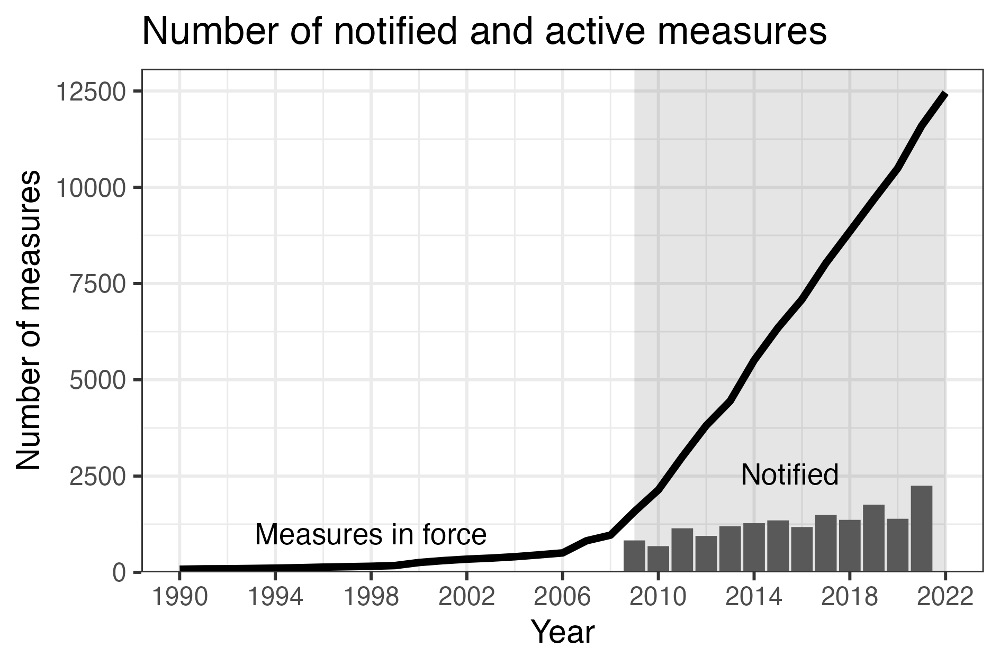
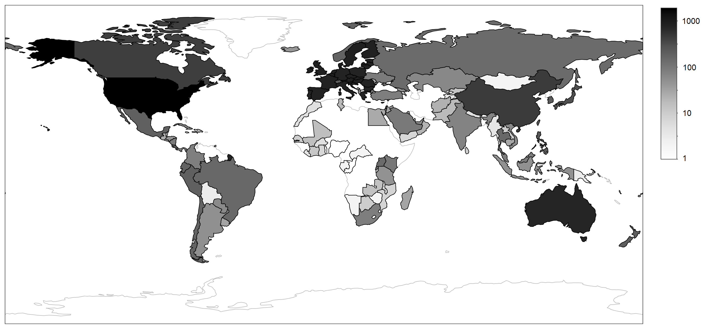
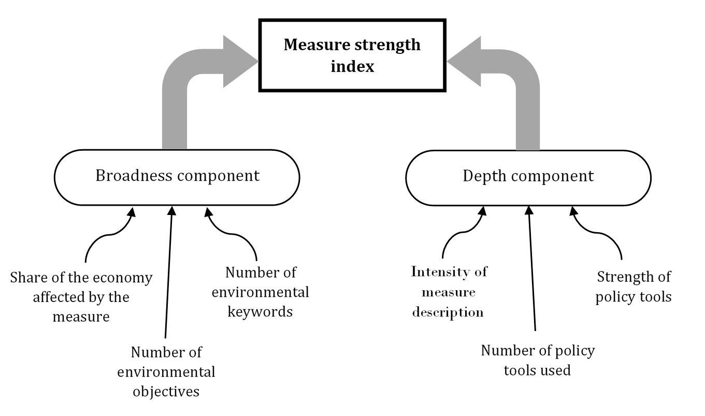

<style>
.column-left55{
  float: left;
  width: 55%;
  text-align: left;
}
.column-left40{
  float: left;
  width: 55%;
  text-align: left;
}
.column-left60{
  float: left;
  width: 60%;
  text-align: left;
}
.column-right40{
  float: right;
  width: 40%;
  text-align: left;
}
.column-right55{
  float: right;
  width: 55%;
  text-align: left;
}
.column-right60{
  float: right;
  width: 60%;
  text-align: left;
}
</style>

<style>
div.blue { background-color:#e6f0ff; border-radius: 5px; padding: 20px;}
</style>
<div class = "blue">

**Download the latest version of the EDB data extension**

- Data [grouped by measure](data files/Extended EDB by measure.zip) (good for analysing measures)
- Data [grouped by measure - country](data files/Extended EDB by measure-country.zip) (good for merging with country data)
- Data [grouped by measure - country - HS chaper](data files/Extended EDB by measure-country-HS chapter.zip) (good for merging with trade data)

*Last update: 17.07.2022 --- EDB version 2021*

**Please reference as:** <br>
[Bellelli, F.S. and Xu, A. (2022) How do environmental policies affects green innovation and trade? Evidence from the WTO environmental database (EDB), *WTO Staff Working Paper, ERSD-2022-23*.](https://www.wto.org/english/res_e/reser_e/ersd202203_e.pdf)
</div>


## What is the EDB?

The *WTO Environmental Database* (EDB) is a collection of environment-related policies notified to WTO Members. For each policy, the database contains a description of the measure and information on the  economic sector, the type of instruments used and the environmental goal pursued by the policy. 

The EDB is organised in two distinct datasets according to the sources of its information: the Trade Policy Reviews (TPR) and Member notifications. TPR are are periodical assessment of Members' policies organised by the WTO. Their aim is to draw a systematic profile of the Members' trade policies and practices. The latest version of the *TPR* and *notification* datasets are downloadable as an Excel or CSV file from: https://edb.wto.org/search. 


## What is the EDB data extension? {.tabset .tabset-fade .tabset-pills}

The EDB contains a wealth of information on environmental policies implemented across the world. It is one of the most comprehensive databases on this subject. However, much of its information is encoded in a textual format. This makes it hard to use it in quantitative research projects. 

Our goal is to make the database more accessible for research and policy analysis by extracting and extending the set of available information using text analysis techniques. The data provided in this webpage is an extended version of the official EDB notification dataset. On top of the variables of the official EDB, our dataset includes additional columns containing information that we extract algorithmically from the EDB. A full description of our approach is available in @EDB_paper.

Click on the tabs below to explore the main features of the EDB extension.

```{r panelset, echo=FALSE}
xaringanExtra::use_panelset()
```

::: l-body-outset
::::: {.panelset}
::: {.panel}

### Implementation years {.panel-name}

<div class="column-left55">
```{r echo=FALSE, fig.cap="Measures in force vs notified (EDB v.2018)"}

```
</div>
<div class="column-right40">
<br><br>
In its current form, the EDB notification dataset is organised along the year of notification of policy measures. However, researchers are usually interested in the year of implementation of the measure. That is to say, the year in which the policy enters into force and, if applicable, when its implementation ends.

**Our EDB extension contains information on the starting and ending year of policy measures' implementation**, which we extracted from the textual description present in the original EDB. 
</div>


:::
::: {.panel}

### HS chapters {.panel-name}

Since the reporting obligations are not uniform across WTO agreements, the structure of notifications and the set of information provided vary according to the agreement under which the measure was notified. Only about a quarter of the notified measures report an [HS](https://en.wikipedia.org/wiki/Harmonized_System) or [ICS](https://en.wikipedia.org/wiki/International_Classification_for_Standards) code describing the goods to which it relates.  Having an idea of the goods affected by the other measures could be useful for trade related research.

**Our EDB extension identifies possible 2-digits HS codes for 90% of the measures in the database.** We use natural language processing techniques to parse the description of the measures and identify potential links with HS codes. The linkage is based on how well the wording in the description matches the products listed in HS chapters. We then use information on economic sector and environmental goals of the measure to narrow down the potential matches.


:::
::: {.panel}

### Countries {.panel-name}

**For multi-state Members (e.g. European Union), we identify all countries affected by the policy measure.** This should make it easier to merge the database with country-level economic data or plot maps.

Moreover, our data extension is available in three formats: measure, country-measure, country-measure-HS chapter. In the first, each line of the dataset corresponds to a notified environment-related policy (just like the original EDB). In the second one, entries are also split according to the countries they affect: Every line corresponds to a country-measure combination. Finally, the last format is also split for the [2-digits HS codes](https://en.wikipedia.org/wiki/Harmonized_System) affected by the policy. 


```{r echo=FALSE, fig.cap="Number of environment-related measures by country (EDB v.2018)"}

```


:::
::: {.panel}

### Similar measures {.panel-name}

Some of the policy measures in the EDB have been renewed or notified multiple times. Therefore, the same measure might appear multiple time at different dates. **To help identifying these measures, we developed an index of measure similarity**. The index is calculated from the proportion of words in the measure descriptions that pairs of measures share in common.

:::
::: {.panel}

### HS/ICS detection {.panel-name}

About a quarter of all notified measures in the EDB report an [HS](https://en.wikipedia.org/wiki/Harmonized_System) or [ICS](https://en.wikipedia.org/wiki/International_Classification_for_Standards) code describing the goods to which it relates. These are two product classifications commonly used to categorise trade flows. 

One obstacle in using this information is that ICS and HS codes are mixed together in the original EDB dataset. To make matters worse, ICS and HS codes look very similar: they are both sequences of numbers. **We address this issue by identifying and separating HS, ICS and ambiguous codes in three separate columns.**


:::
::: {.panel}

### Policy score {.panel-name}

<div class="column-left60">
```{r echo=FALSE, fig.cap="Policy score components"}

```
</div>
<div class="column-right40">
**We attempt to build an indicator of measure strength based on the information in the EDB database**. Our measure score is built along two conceptual dimensions: the policy *breadth* and *depth*. We consider as broad, measures that affect a larger share of the economy and tackle multiple environmental issues. On the other hand, the depth of a measure refers to the intensity of its provisions. We base our depth scoring on the type of policy instrument used in the measure and the wording of the measure description.
</div>

:::
:::
---
:::


## EDB extension updates

The EDB notification dataset gets updated annually by the WTO secretariat. As a new version comes out, we will update the EDB extension to provide information on the latest measures in the database. We designate EDB's version by the latest notification year included in their data. For example, the release (EDB version 2019) includes measures notified up to 2019.


