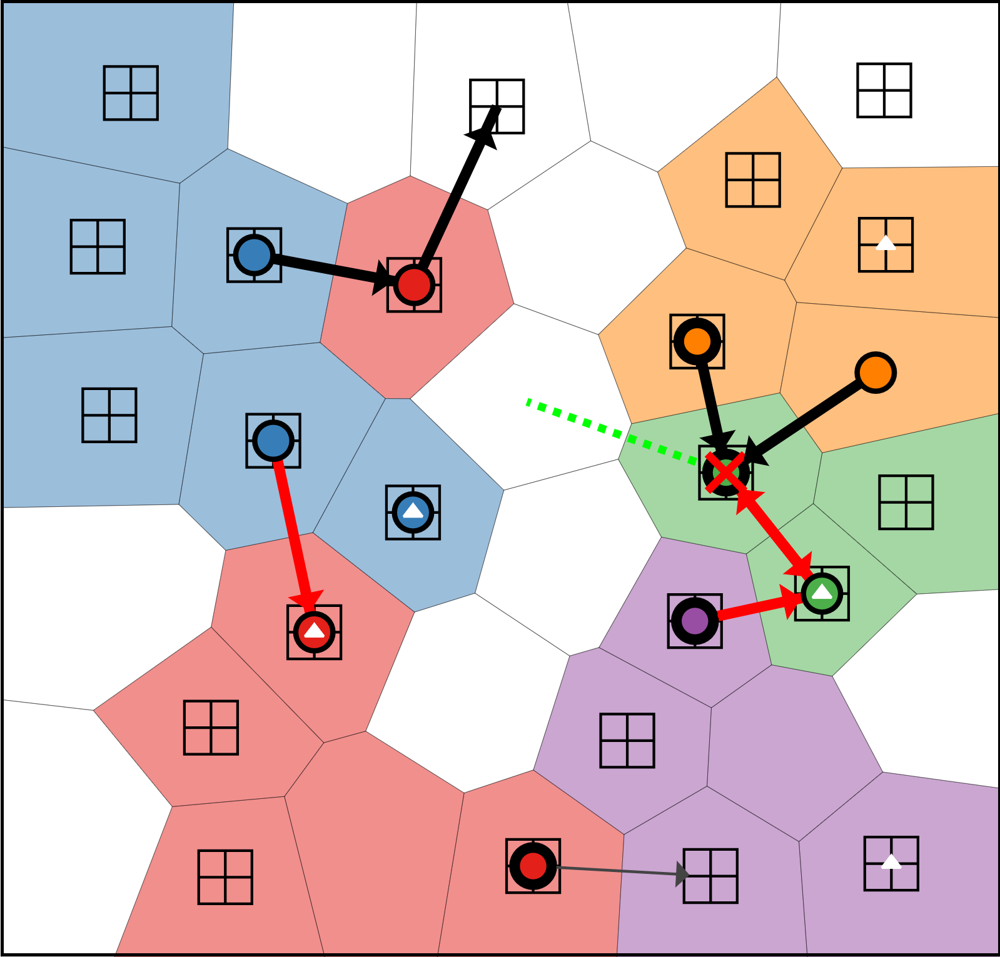

<style>
div.blue { background-color:#e6f0ff; border-radius: 5px; padding: 20px;}
</style>


<div class = "blue"><center>A link to the game **Tile master** is available [here](https://fbellelli.shinyapps.io/TileMaster/). </center></div>
<br>

After a look at the amazing gallery of dashboards and interactive data visualisations from [Shiny apps](https://shiny.rstudio.com/), I decided that I had to explore its functionalities by trying a project on my own.

Shiny allows R users to quickly build and share simple apps that run on browsers. They are ideal for data visualisation. It is really easy to create interactive charts and combine them in a beautiful dashboards. So why not trying to plot some interesting economic data? I should have thought about this a bit longer. For some inexplicable reason, I decided it would be interesting to implement a strategy board game on a shiny app. 

It was a challenging project. It took some time, and a lot more coding than originally planned, but eventually I managed to implement a playable game with Shiny. For the moment I didn't write down the games' rules and didn't include a tutorial. So, if you don't mind figuring the rules out by trial and error, feel free to give it a try! No fun is guaranteed.

This game was an enriching journey. I ended up exploring all sorts of unexpected subjects: from path finding algorithms and Delaunay triangulation to advanced game developing concepts. I also thoroughly enjoyed building the AI for this game. Given the strategic complexity of the game --- and being the first AI I ever built --- I am quite pleased with the final result. I experimented with different AI approaches, programmatic, machine learning and hybrids. In its final version, the basic AI decision process is a hybrid between a finite-state machine and a utility-based system. I then improved it by training machine learning models to evaluate the AI's moves. 

I implemented many functionalities in the app. Users can save and load games, generate random maps with customisable parameters, select AI difficulty level and even play in a shared-screen multiplayer mode. In the end, it was a great learning project! 


```{r, echo=FALSE, preview=TRUE}

```

