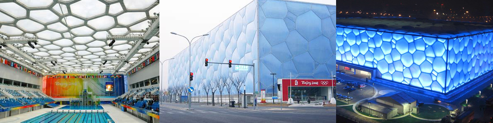
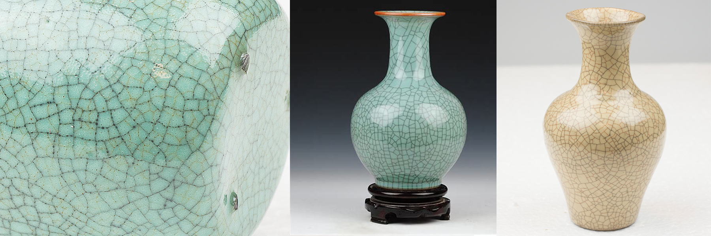
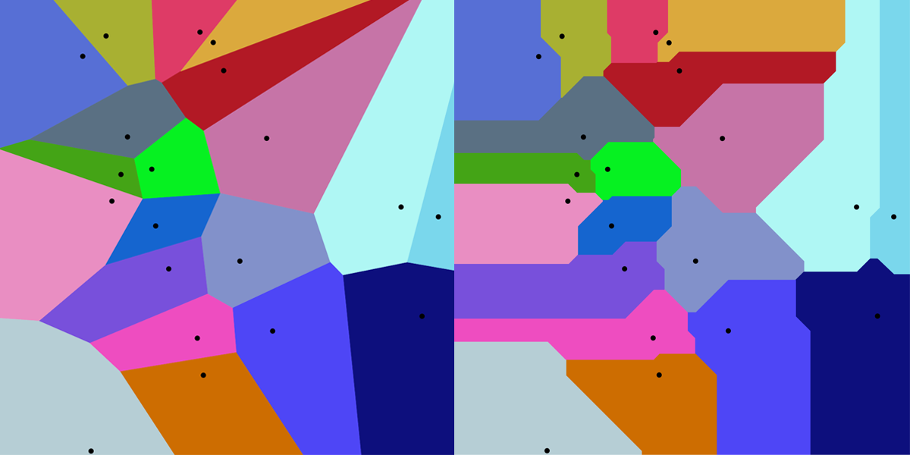
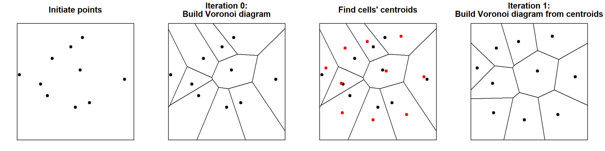
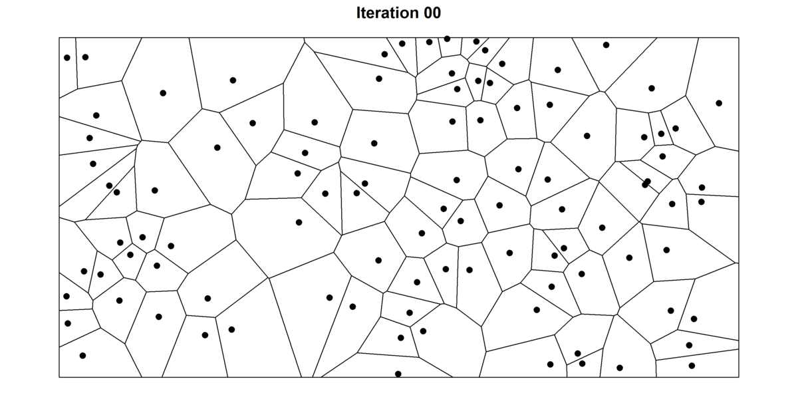
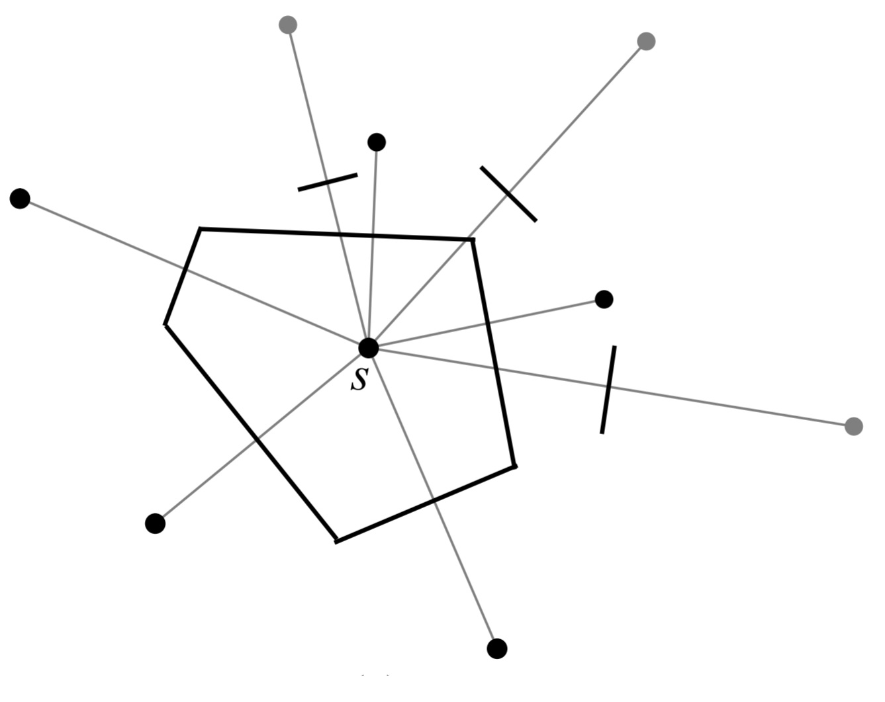
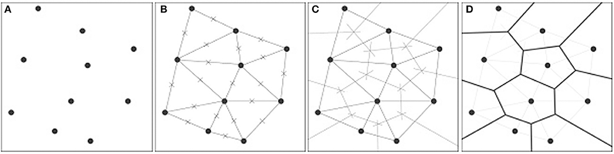
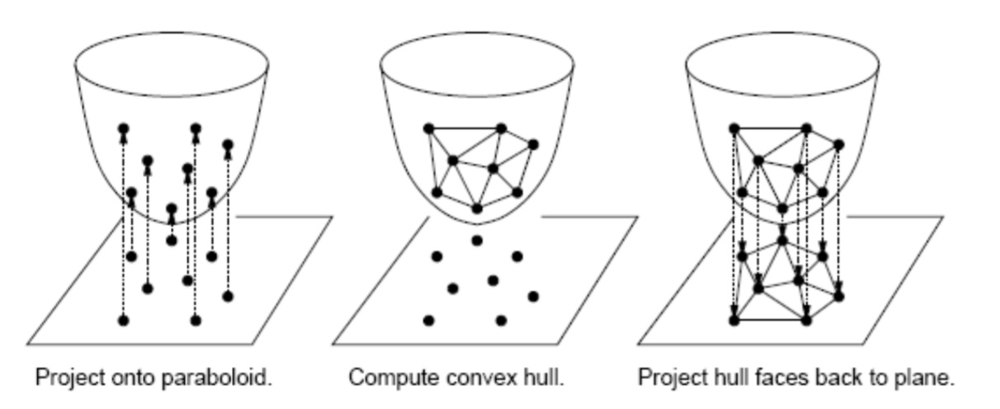

```{r setup, include=FALSE}
knitr::opts_chunk$set(echo = FALSE)
```


```{r, layout="l-body"}
knitr::include_graphics("voronoi_colour.png")
```


**Voronoi diagrams** (also known as *Dirichlet tesselation* or *Thiessen polygons*) are everywhere in nature. You have encountered them thousands of times, but maybe did not call it this way. Voronoi diagram are simple, yet they have incredible properties which have found applications in fields ranging from cartography, biology, computer science, statistics, archaeology, all way to architecture and arts. 

## What is a Voronoi diagram?


Suppose you have $n$ points scattered on a plane, the Voronoi diagram of those points subdivides the plane in exactly $n$ cells enclosing the portion of the plane that is the closest to the each point. This produces a tessellation that completely covers the plane. As an illustration, in Figure 1, I plotted 100 random points and their corresponding Voronoi diagram. As you can see, every point is enclosed in a cell, whose boundaries are exactly equidistant between two or more points. In other words, all the area enclosed in the cell is closest to the point in the cell than to any other point.  


```{r, fig.cap="Voronoi diagram from 100 random points in a plane", fig.align='center',fig.height=3, fig.width=6}

library(tidyverse)
library(ggvoronoi)

set.seed(123321)
x <- sample(0:1000,100)
set.seed(321123)
y <- sample(0:500,100)

points <- data.frame(x,y)

ggplot(points,aes(x,y)) +  
  stat_voronoi(geom="path") +
  theme_void() +                 #remove axis
  theme(axis.text=element_blank(),  #remove axis text and title
        axis.title=element_blank(),
        legend.position = "none")+
  scale_x_continuous(expand = c(0,0))+
  scale_y_continuous(expand = c(0,0))+
  geom_point(aes(x,y))

```


## Voronoi patterns are ubiquitous

### Voronoi patterns in nature

The pattern created by Voronoi diagrams is a common one in nature. In Figure 3, I made a small collage of some naturally occurring Voronoi-like patterns. From microscopic cells in onion skins, to the shell of jackfruits and the coat of giraffes. These patterns are everywhere! 

A first reason for their omnipresence is that they form efficient shapes. As we mentioned earlier, Voronoi diagram completely tessellates the plan: hence, all space is used. This is very convenient if you are trying to squeeze as much as possible in a limited space --- such as in muscle fibres or bee hives. Secondly, Voronoi diagrams are a spontaneous pattern whenever something is growing at a uniform growth rate from separate points (see Figure 2). For instance, this explains giraffe exhibit such patterns. Giraffe embryos have a scattered distribution of melanin-secreting cells, which is responsible for the dark pigmentation of the giraffe's spots. Over the course of the gestation these cells release melanin --- hence spots radiate outward. Interested reader may refer to [this paper](https://www.iro.umontreal.ca/~poulin/fournier/papers/Walter-2001-ISP/Walter-2001-ISP.pdf), in which the authors use Voronoi diagrams to model computer rendering of spots on animals coats.

```{r, layout="l-body side",fig.cap="A Voronoi diagram is obtained from constant outward growth from dispered points<br>Source: Wikipedia", width ="50px",fig.align='center'}
knitr::include_graphics("Voronoi_growth_euclidean.gif")
```


```{r, fig.cap="Voronoi patterns are everywhere in nature. <br>(From top-left to bottom right: microscope view of onion skin cells, cross-section of a muscle, garlic bulb, wings of a dragonfly, soap bubbles, close-up of a leaf, giraffes coat patterns, corns, jackfruits hanging from a tree.)"}
knitr::include_graphics("collage voronoi.png")
```


### Voronoi pattern in architecture and arts

Perhaps because of their spontaneous "natural" look, or simply because of their mesmerising randomness, Voronoi patterns have intentionally been implemented in human-made structures. An architectural example is the "Water cube" built to house the water sports during the 2008 Beijing Olympics. It features Voronoi diagrams on its ceiling and façades (Figure 4). The Voronoi diagrams were chosen because they recall bubbles^[To be more precise, the "Water cube" patterns are inspired from [Weaire-Phelan](https://en.wikipedia.org/wiki/Weaire%E2%80%93Phelan_structure) bubbles. However, these are directly obtainable as Voronoi diagram.]. This analogy is very clear at night, when the entire façade is illuminated in blue and comes alive. 

```{r, fig.cap="Water cube in Beijing", fig.align='center'}

```

But Chinese appreciation of Voronoi pattern is surely older than this building. [Guan](https://en.wikipedia.org/wiki/Guan_ware) and  [Ge](https://en.wikipedia.org/wiki/Ge_ware) ware from the Song dynasty have a distinctive crackled glaze. Ceramics can easily crack during the cooling process, however the crackles from the Guan and Ge ware are different --- they are intentional. They are sought after because of their aesthetic qualities. Thanks to the Voronoi-like patterns on their surface, each piece is unique. To date, this is one of the most imitated styles of porcelain (Figure 5).  


```{r, fig.cap="Guan and Ge wares", fig.align='center'}

```

Voronoi diagrams are also common in graphic arts for creating "abstract" patterns. I think they make excellent background images. For example, I created the thumbnail of this post by generating random points and constructing a Voronoi diagram. Then, I coloured each cell based on the distance of its point from a randomly selected spot in the box (Figure 6). Endless "abstract" backgrounds images could be generated this way.

```{r fig.cap="Coloured Voronoi diagram", fig.align='center'}
knitr::include_graphics("voronoi_animation2.gif")
```


## Mathematical definition and some interesting properties

So far, we have presented a simple two-dimensional Voronoi diagram. However, the same type of structure can be generalised to an $n$-dimensional space. Suppose $P=\{p_1,p_2,...,p_m\}$ is a set of $m$ points in our n-dimensional space. Then, the space can be partitioned in $m$ Voronoi cells, $V_i$, containing all points in $\mathbb{R}^n$ that are closer to $p_i$ than to any other point. 

$$V_i = \left\{x : \forall j \neq i, d(x, p_i) \leq d(x,p_j)\right\} \text{, with } i,j \in \{1,2,...,m\}$$
Where the function $d(x,y)$ gives the distance ($a$) between its two arguments. Typically, the Euclidean distance is used ($l^2$ distance): 

$$d(x,y)=||x-y||_2=\sqrt{\sum_{k=1}^{n}(x_k-y_k)^2}$$
However, Voronoi diagrams could be designed using other distance functions. For instance, Figure 7 shows a Voronoi diagram obtained with the Manhattan or cityblock distance ($l^1$ distance). The Manahattan distance is the distance between two points if you had to follow a regular grid --- such as the city blocks of Manhattan. The result is a more "boxy" Voronoi diagram. $$d(x,y)=||x-y||_1=\sum_{k=1}^{n}{|x_k-y_k|}$$

<aside>
```{r, fig.align='center',fig.cap="Euclidean and Manhattan distance<br>Source:[Johnson Hsieh](https://johnsonhsieh.github.io/DSC2016-R/slide/R-Data-Mining.html#1)"}

knitr::include_graphics("distances.png")

```
</aside>

```{r, fig.align='center',fig.cap="Comparison of Voronoi diagrams using the Euclidean (left) and Manhattan (right) distance for a same set of points<br>Source: [Wikipedia](https://en.wikipedia.org/wiki/File:Manhattan_Voronoi_Diagram.svg)"}



```


Euclidean distance is the most common distance measure in scientific applications of the Voronoi diagram. It also has the advantage of generating Voronoi cells that are **convex**. That is to say, if you take any two points within a cell, the line that connects the two points will lie entirely within the cell.  

Finally, it should also be noted that Voronoi diagrams are tightly linked with the k-nearest neighbours algorithm (k-NN) --- a very popular algorithm in classification, regression and clustering problems. The algorithm uses the $k$ closest examples in the training dataset to make value predictions. Since the Voronoi diagrams partitions the space in polygons containing the closest points to each seed, the edges of Voronoi cells correspond exactly to the decision boundaries of a simple 1-nearest neighbour problem.  


## Delaunay triangulation

If you take each of the points from a Voronoi diagram and link it with the points in its neighbouring cells, you will obtain a graph called **Delaunay triangulation**. In mathematical terms, the Delaunay triangulation is the [dual graph](https://www.wikiwand.com/en/Dual_graph) of the Voronoi diagram. In the Figure below, a Voronoi diagram (black) and Delaunay triangulation (grey) is plotted from a set of points. By moving the mouse over the image, one can explore how they are affected by a new point.


```{r, layout="l-body-outset", fig.align='center', fig.cap="Voronoi diagram and Delaunay triangulation<br>Source: [r2d3](https://rstudio.github.io/r2d3/articles/gallery/voronoi/)"}
library(r2d3)
r2d3(d3_version = 4, script = "d3/voronoi.js", css="d3/voronoi.css")
```


Delaunay triangulation is just as amazing as Voronoi diagrams. As the name suggests, it produces a set of triangles linking our points. These triangles are such that if one were to draw a circle across the vertices of these triangles, there would be no other point inside the circle (See Figure 10). Moreover, Delaunay triangulation also has the property of maximising the smallest angle of in the triangles of the triangulation. Hence, Delaunay triangulation tends to avoid triangles with acute angles. 

```{r, fig.align='center',fig.cap="Delaunay triangles are constructed such that no point falls inside the circle circumscribing each triangle<br>Source: [Wikipedia](https://en.wikipedia.org/wiki/File:Delaunay_circumcircles_vectorial.svg)"}

library(magick)
prova<-magick::image_read("https://upload.wikimedia.org/wikipedia/commons/d/db/Delaunay_circumcircles_vectorial.svg")
magick::image_resize(prova,geometry_size_pixels(width = 700, preserve_aspect = TRUE))
```


These properties make it very useful in modelling surfaces and objects from a set of points. For instance, the Delaunay triangulation is used to generate meshes for the [finite element method](https://people.eecs.berkeley.edu/~jrs/meshpapers/delnotes.pdf) and in facial recognition, construct 3D models for computer animations and model terrain in GIS analysis. 


```{r, fig.align='center',fig.cap="Delaunay triangulation is used to produce meshes for facial recognition<br>Source: [Learn OpenCV](https://learnopencv.com/delaunay-triangulation-and-voronoi-diagram-using-opencv-c-python/)"}
knitr::include_graphics("https://learnopencv.com/wp-content/uploads/2015/11/opencv-delaunay-Voronoi-subdiv-example.jpg")
```


## Lloyd's relaxation algorithm

**Llyod's algorithm** is a useful algorithm related to Voronoi diagrams. The algorithm consists in repeatedly alternating between constructing Voronoi diagrams and finding the centroids (i.e. center of mass) of each cell (See Figure 12). At each iteration, the algorithm spaces the points apart and produces more homogeneous Voronoi cells. 


```{r layout="l-body-outset", fig.align='center', fig.cap="Steps in Lloyd's relaxation algorithm"}

```

After a few iterations, the cells will already have a "rounder" aspect and points will be more evenly distributed. This is illustrated in the figure below, in which I have plotted the first 30 iterations of the Lloyd's algorithm for a random set of points. For each point, I also record their starting position (grey hollow circle) to better trace the movement of each cell. For high number of iterations, the diagram tends to converge towards a stable Voronoi diagram in which every seed is also the centroid of the cell --- also known as the [centroidal Voronoi diagram](https://en.wikipedia.org/wiki/Centroidal_Voronoi_tessellation). Interestingly, in 2D, Voronoi cells will tend to turn into hexagons because they provide the most efficient way of of packing shapes in a plane.  As any bee building their hive can certify, hexagonal cells have two big advantages: 1) they ensure no empty space is left between cells (i.e. tessellates the plane), and 2) hexagons offer the highest ratio between surface and perimeter of the cell. This so-called **[Honeycomb conjecture](https://en.wikipedia.org/wiki/Honeycomb_conjecture)**, took mathematicians two-thousand years to prove.


```{r layout="l-body-outset", fig.align='center', fig.cap="30 iterations of the Lloyd's algorithm"}

```


In data science, Lloyd's algorithm is at the basis of **k-means clustering** --- one of the most popular clustering algorithms. k-means clustering is typically initiated by taking $k$ random "centroids" in space. Then, data points are grouped in $k$ clusters by alternating between 1) assigning data points to the closest "centroid" (this is equivalent to building a Voronoi diagram for the centroid and checking which point are inside the cell) and 2) updating the centroid by calculating the mean of the points inside each cell (See Figure 14).


```{r layout="l-body", fig.align='center', fig.cap="k-means clustering<br>Soruce: [Wikipedia](https://en.wikipedia.org/wiki/File:K-means_convergence.gif)"}
knitr::include_graphics("K-means_convergence.gif")
```

Besides data science, Lloyd's algorithm is used in a variety of applications. For instance, it is very common in quantization and lossy data compression algorithms (e.g. [Lloyd-Max algorithm](http://helmut.knaust.info/presentations/2011/20110106_JMM_DWT.pdf)). It is also very useful whenever one wants random points that are nicely spaced. For instance, it could be used to smooth meshes generated from the Delaunay triangulation, for [dithering](https://en.wikipedia.org/wiki/Dither) images, or as a basis for [procedural maps generation](https://en.wikipedia.org/wiki/Procedural_generation) in video games.


## How to construct Voronoi diagrams?


One could construct Voronoi diagrams by building each cell one by one. If one extends the bisector of the segments linking every combination of points, it is possible to obtain the outline of Voronoi cells (Figure 15). However, this technique is quite inefficient. Considering there are $\frac{1}{2}(1-n)n$ combinations of points, the complexity of such algorithm would increase quadratically with the number of points.


```{r layout="l-body", fig.align='center', fig.cap="Construction of Voronoi cells<br>Source: [Roberto Tamassia](http://cs.brown.edu/courses/cs252/misc/resources/lectures/pdf/notes09.pdf)"}

```


More efficient alternatives have been proposed. For example, the [Sweep line algorithm](https://en.wikipedia.org/wiki/Fortune%27s_algorithm) builds Voronoi cells progressively by sequentially using binary search tree and priority queue operations (Figure 16). A good description of this algorithm can be found [here](https://www.ams.org/publicoutreach/feature-column/fcarc-voronoi). Another way of constructing Voronoi diagrams, is to first build Delaunay triangulations. Once the triangulation is obtained, extending the bisectors of the triangle edges leads to the Voronoi diagram (Figure 17). Delaunay triangulation can be obtained without the need of considering every pair of points. For instance, an efficient technique consists in projecting the points on a paraboloid in a higher dimension. Re-projecting back the convex hull onto the original space gives the Delaunay triangulation (Figure 18)

<aside>
```{r layout="l-body", fig.align='center', fig.cap="Sweep line algorithm<br>Source: [Wikipedia](https://en.wikipedia.org/wiki/Fortune%27s_algorithm)"}
knitr::include_graphics("Fortunes-algorithm-slowed.gif")
```
</aside>


```{r layout="l-body", fig.align='center', fig.cap="Construction of Voronoi diagrams<br>Source: [Giulia Andreucci](https://www.frontiersin.org/articles/10.3389/fbuil.2018.00078/full)"}

```


```{r layout="l-body", fig.align='center', fig.cap="Using the convex hull method for constructing Delaunay triangulation<br>Source: [Danny Sleator](https://www.cs.cmu.edu/~15451-s15/LectureNotes/lecture17/voronoi.pdf)"}

```


A discussion of different algorithms for computing Voronoi diagram and their complexity is available [here](http://www.cs.tufts.edu/comp/163/notes05/voronoi_handout.pdf), [here](https://www.ic.unicamp.br/~rezende/ensino/mo619/Sacristan,%20Voronoi%20Diagrams.pdf), and [here](https://www.codeproject.com/articles/882739/simple-approach-to-voronoi-diagrams). New algorithms are continuously being proposed to improve computation efficiency in different circumstances (e.g. [Yan et al. 2011](https://www.microsoft.com/en-us/research/wp-content/uploads/2016/12/Efficient-Computation-of-Clipped-Voronoi-Diagram-and-Applications.pdf), [Qin et al. 2017](https://onlinelibrary.wiley.com/doi/abs/10.1111/cgf.13248)). There are also techniques requiring constant time that generate approximate Voronoi diagrams (e.g. [Jump flooding algorithm](Jump Flooding Algorithm)).


## Links to additional material


- [This article](https://plus.maths.org/content/uncovering-cause-cholera) tells the story of how Voronoi diagrams were used by John Snow to show the link between water pumps and the transmission of Cholera during the 1854 London outbreak. 


- [Amil Patel](https://simblob.blogspot.com/search/label/voronoi) has a phenomenal blog on game development. I highly recommend his posts on procedural map generation with Voronoi diagrams.

- [This post by David Austin](https://www.ams.org/publicoutreach/feature-column/fcarc-voronoi)  gives a great explanation of the Sweep line algorithm for computing Voronoi diagrams.

- [This nice looking map](https://www.jasondavies.com/maps/voronoi/airports/) by Jason Davies is a Voronoi diagram of the location of airports around the world.

- *[Spatial Tessellations: Concepts and Applications of Voronoi Diagrams](https://onlinelibrary.wiley.com/doi/book/10.1002/9780470317013)* is a bible on Voronoi diagrams. If you have any doubt about Voronoi diagrams, you will certainly find an answer here.

- [These slides](https://perso.uclouvain.be/vincent.legat/documents/meca2170/meca2170-cours7-Voronoi.pdf) from Vincent Legat have some beautiful drawings for different construction algorithms.  

- Voronoi diagrams are commonly used to model trees in forests (e.g. [Abellanas et al. 2016](https://pommerening.org/wiki/images/a/a4/Vorest.pdf), [Bohler et al. 2018](https://www.sciencedirect.com/science/article/abs/pii/S0925772117300652)).

- Voronoi diagrams can also be used to determine robot's paths. Check these articles: [article 1](http://www.cs.columbia.edu/~pblaer/projects/path_planner/), [article 2](https://gamedevelopment.tutsplus.com/tutorials/how-to-use-voronoi-diagrams-to-control-ai--gamedev-11778).


- Voronoi diagrams have thousand of applications. From modelling trees in a forest to planning robot paths. In this article I barely scratched the surface. These links contain lists of interesting applications: [link 1](https://www.ics.uci.edu/~eppstein/gina/voronoi.html), [link 2](https://www.ics.uci.edu/~eppstein/gina/scot.drysdale.html), [link3](https://en.cnki.com.cn/Article_en/CJFDTotal-GCTX200402022.htm), [link4](https://ratt.ced.berkeley.edu/readings/read_online/Aurenhammer.%20%20Voronoi%20diagrams.%20%20A%20survey%20of%20a%20fundamental%20geometric%20data%20structure.pdf), [link 5](https://www.sciencedirect.com/topics/physics-and-astronomy/voronoi-diagrams). 


