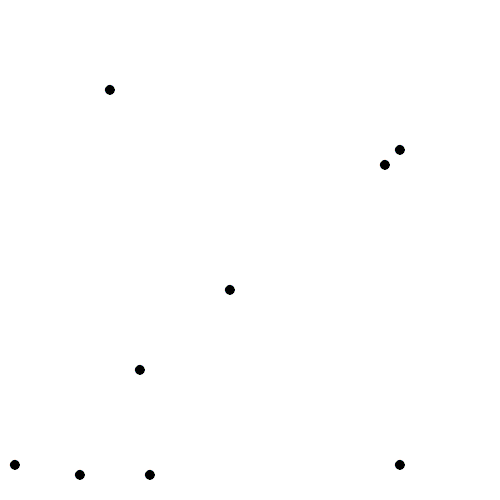
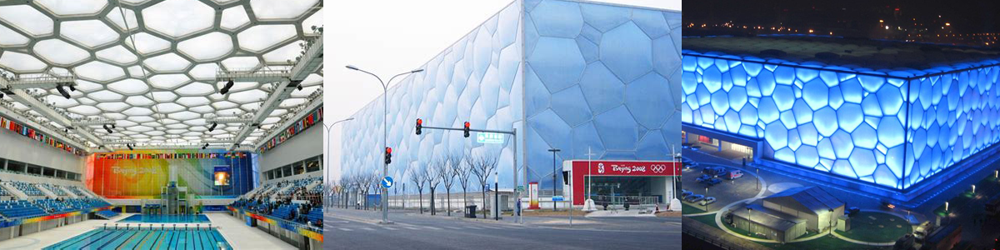
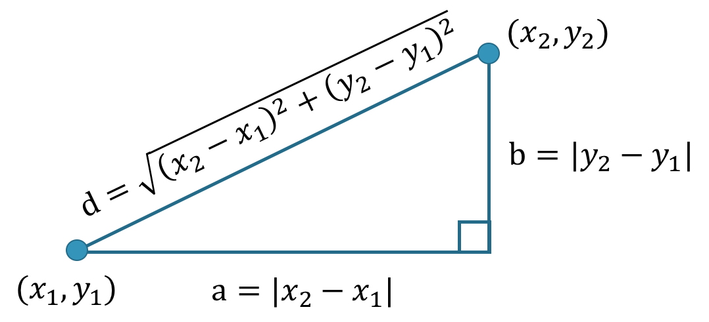

```{r setup, include=FALSE}
knitr::opts_chunk$set(echo = FALSE)
```


```{r, layout="l-body"}
knitr::include_graphics("voronoi_colour.png")
```


**Vornoi diagrams** (also known as *Dirichlet tesselation* or *Thiessen polygons*) are everywhere in nature. You have encountered them thousands of times, but maybe did not call it this way. Voronoi diagram are simple, yet they have incredible properties which have found applications in fields ranging from cartography, biology, computer science, statistics, archaeology, all way to architecture and arts. 

## What is a Voronoi diagram?


Suppose you have $n$ points scattered on a plane, the Voronoi diagram of those points subdivides the plane in exactly $n$ cells enclosing the portion of the plane that is the closest to the each point. This produces a tessellation that completely covers the plane. As an illustration, in Figure 1, I plotted 100 random points and their corresponding Voronoi diagram. As you can see, every point is enclosed in a cell, whose boundaries are exactly equidistant between two or more points. In other words, the cells shows 


```{r, fig.cap="Voronoi diagram from 100 random points in a plane", fig.align='center',fig.height=3, fig.width=6}

library(tidyverse)
library(ggvoronoi)

set.seed(123321)
x <- sample(0:1000,100)
set.seed(321123)
y <- sample(0:500,100)

points <- data.frame(x,y)

ggplot(points,aes(x,y)) +  
  stat_voronoi(geom="path") +
  theme_void() +                 #remove axis
  theme(axis.text=element_blank(),  #remove axis text and title
        axis.title=element_blank(),
        legend.position = "none")+
  scale_x_continuous(expand = c(0,0))+
  scale_y_continuous(expand = c(0,0))+
  geom_point(aes(x,y))

```


## Vornoi patterns are ubiquitous

### Voronoi patterns in nature

The pattern created by Vornoi diagrams is a common one in nature. In Figure 3, I made a small collage of some naturally occurring Vornoi-like patterns. From microscopic cells in onion skins, to the shell of jackfruits and the coat of giraffes. These patterns are everywhere! 

A first reason for their omnipresence is that they form efficient shapes. As we mentioned earlier, Vornoi diagram completely tessellates the plan: hence, all space is used. This is very convenient if you are trying to squeeze as much as possible in a limited space --- such as in muscle fibres or bee hives. Secondly, Vornoi diagrams are a spontaneous pattern whenever something is growing at uniform growth rates from separate points (see Figure 2). For instance, this explains giraffe exhibit such patterns. Giraffe embryos have a scattered distribution of melanin-secreting cells, which is responsible for the dark pigmentation of the giraffe's spots. Over the course of the gestation these cells release melanin --- hence spots radiate outward. Interested reader may refer to [this paper](https://www.iro.umontreal.ca/~poulin/fournier/papers/Walter-2001-ISP/Walter-2001-ISP.pdf), in which the authors use Vornoi diagrams to model computer rendering of spots on animals coats.

```{r, layout="l-body side",fig.cap="A Vornoi diagram is obtained from constant outward growth from dispered points<br>Source: Wikipedia", width ="50px",fig.align='center'}

```


```{r, fig.cap="Voronoi patterns are everywhere in nature. <br>(From top-left to bottom right: microscope view of onion skin cells, cross-section of a muscle, garlic bulb, wings of a dragonfly, soap bubbles, close-up of a leaf, giraffes coat patterns, corns, jackfruits hanging from a tree.)"}
knitr::include_graphics("collage voronoi.png")
```


### Voronoi pattern in architecture and arts

Perhaps because of their spontaneous "natural" look, or simply because of their mesmerising randomness, Vornoi patterns have intentionally been implemented in human-made structures. An architectural example is the "Water cube" built to house the water sports during the 2008 Beijing Olympics. It features Voronoi diagrams on its ceiling and façades (Figure 4). The Vornoi diagrams were chosen because they recall bubbles. This analogy is very clear at night, when the entire façade is illumanated in blue and comes alive. 

```{r, fig.cap="Water cube in Beijing", fig.align='center'}

```

But Chinese appreciation of Vornoi pattern is surely older than this building. [Guan](https://en.wikipedia.org/wiki/Guan_ware) and  [Ge](https://en.wikipedia.org/wiki/Ge_ware) ware from the Song dynasty have a distinctive crackled glaze. Ceramics can easily crack during the cooling process, however the crackles from the Guan and Ge ware are different --- they are intentional. They are sought after because of their aesthetic qualities. Thanks to the Vornoi-like patterns on their surface, each piece is unique. To date, this is one of the most imitated styles of porcelain (Figure 5).  


```{r, fig.cap="Guan and Ge wares", fig.align='center'}
knitr::include_graphics("Guan Ge ware2.png")
```

Vornoi diagrams are also common in graphic arts for creating "abstract" patterns. I think they make excellent background images. For example, I created the thumbnail of this post by generating random points and constructing a Voronoi diagram. Then, I coloured each cell based on the distance of its point from a randomly selected spot in the box (Figure 6). Endless "abstract" backgrounds images could be generated this way.

```{r fig.cap="Coloured Vornoi diagram", fig.align='center'}
knitr::include_graphics("voronoi_animation2.gif")
```


## Mathematical definition and some interesting properties

So far, we have presented a simple two-dimensional Vornoi diagram. However, the same type of structure can be generalised to an $n$-dimensional space. Suppose $P=\{p_1,p_2,...,p_m\}$ is a set of $m$ points in our n-dimensional space. Then, the space can be partitioned in $m$ Vornoi cells, $V_i$, containing all points in $\mathbb{R}^n$ that are closer to $p_i$ than to any other point. 

$$V_i = \left\{x : \forall j \neq i, d(x, p_i) \leq d(x,p_j)\right\} \text{, with } i,j \in \{1,2,...,m\}$$
Where the function $d(x,y)$ gives the distance ($a$) between its two arguments. Typically, the Euclidean distance is used ($l^2$ distance): 

$$d(x,y)=||x-y||_2=\sqrt{\sum_{k=1}^{n}(x_k-y_k)^2}$$
However, Vornoi diagrams could be designed using other distance functions. For instance, Figure 7 shows a Vornoi diagram obtained with the Manhattan or cityblock distance ($l^1$ distance). The Manahattan distance is the distance between two points if you had to follow a regular grid --- such as the city blocks of Manhattan. The result is a more "boxy" Vornoi diagram. $$d(x,y)=||x-y||_1=\sum_{k=1}^{n}{|x_k-y_k|}$$

<aside>
```{r, fig.align='center',fig.cap="Euclidean and Manhattan distance<br>Source:[Johnson Hsieh](https://johnsonhsieh.github.io/DSC2016-R/slide/R-Data-Mining.html#1)"}



```
</aside>

```{r, fig.align='center',fig.cap="Comparison of Vornoi diagrams using the Euclidean (left) and Manhattan (right) distance for a same set of points<br>Source: [Wikipedia](https://en.wikipedia.org/wiki/File:Manhattan_Voronoi_Diagram.svg)"}

knitr::include_graphics("manhattan-voronoi2.png")

```


Euclidean distance is the most common distance measure in scientific applications of the Voronoi diagram. It also has the advantage of generating Vornoi cells that are **convex**. That is to say, if you take any two points within a cell, the line that connects the two points will lie entirely within the cell.  

Finally, it should also be noted that Vornoi diagrams are tightly linked with the k-nearest neighbours algorithm (k-NN) --- a very popular algorithm in classification, regression and clustering problems. The algorithm uses the $k$ closest examples in the training dataset to make value predictions. Since the Vornoi diagrams partitions the space in polygons containing the closest points to each seed, the edges of Vornoi cells correspond exactly to the decision boundaries of a simple 1-nearest neighbour problem.  


## Delaunay triangulation

If you take each of the points from a Vornoi diagram and link it with the points in its neighbouring cells, you will obtain a graph called **Delaunay triangulation**. In mathematical terms, the Delaunay triangulation is the [dual graph](https://www.wikiwand.com/en/Dual_graph) of the Vornoi diagram. In the Figure below, a Vornoi diagram (black) and Delaunay triangulation (grey) is plotted from a set of points. By moving the mouse over the image, one can explore how they are affected by a new point.


```{r, layout="l-body-outset", fig.align='center', fig.cap="Vornoi diagram and Delaunay triangulation<br>Source: [r2d3](https://rstudio.github.io/r2d3/articles/gallery/voronoi/)"}
library(r2d3)
r2d3(d3_version = 4, script = "d3/voronoi.js", css="d3/voronoi.css")
```


Delaunay as just as amazing as Vornoi diagrams. As the name suggests, it produces a set of triangles linking our points. These triangles are suc that if one were to draw a circle across the vertices of these triangles, there would be no other point inside the circle (See Figure 10). Moreover, Delaunay triangulation also has the property of maximising the smallest angle of all the angles of the triangles in the triangulation. Hence, Delaunay triangulation tends to avoid triangles with acute angles. 

```{r, fig.align='center',fig.cap="Delaunay triangles are constructed such that no point falls inside the circle circumscribing each triangle<br>Source: [Wikipedia](https://en.wikipedia.org/wiki/File:Delaunay_circumcircles_vectorial.svg)"}

library(magick)
prova<-magick::image_read("https://upload.wikimedia.org/wikipedia/commons/d/db/Delaunay_circumcircles_vectorial.svg")
magick::image_resize(prova,geometry_size_pixels(width = 700, preserve_aspect = TRUE))
```


These properties make it very useful in modelling surfaces and objects from a set of points. For instance, the Delaunay triangulation is used to generate meshes for the [finite element method](https://people.eecs.berkeley.edu/~jrs/meshpapers/delnotes.pdf) and in facial recognition, construct 3D models for computer animations and model terrain in GIS analysis. 


```{r, fig.align='center',fig.cap="Delaunay triangulation is used to produce meshes for facial recognition<br>Source: [Learn OpenCV](https://learnopencv.com/delaunay-triangulation-and-voronoi-diagram-using-opencv-c-python/)"}
knitr::include_graphics("https://learnopencv.com/wp-content/uploads/2015/11/opencv-delaunay-vornoi-subdiv-example.jpg")
```


## Lloyds relaxation algorithm


```{r layout="l-body-outset", fig.align='center'}
knitr::include_graphics("lloyds.png")
```

```{r layout="l-body-outset", fig.align='center'}
knitr::include_graphics("lloyds-line.gif")
```


<br><br>
<font color=”#CC0000”>
<center>
**WRITING IN PROGRESS**
</center>
</font>


<!-- 

spiegare llyods algorithm
fare immagini step 1-2-3 da mettere uno accanto all'altro
fare gif con 30 iterazioni

analogia k-means clustering

dire come esempio uso: spacing points BBBB
data compression and quantization (e.g. dithering)
smooth meshes generated for from delaunay triangulation. more regular triangles


## How are they constructed?

https://www.math.ucla.edu/~tom/papers/tesselations.pdf


## Some applications

https://cklixx.people.wm.edu/teaching/math400/Voronoi-paper.pdf

https://en.wikipedia.org/wiki/Voronoi_diagram

cartography: https://www.pacha-cartographe.fr/le-blog-du-cartographe/voronoi/
John Snow cholera outbreak: Golden Square outbreak, 1854

random map generation:  https://simblob.blogspot.com/search/label/voronoi


PER FINIRE FARE BOX CON LINK A QUALCHE RISORSA

-->


