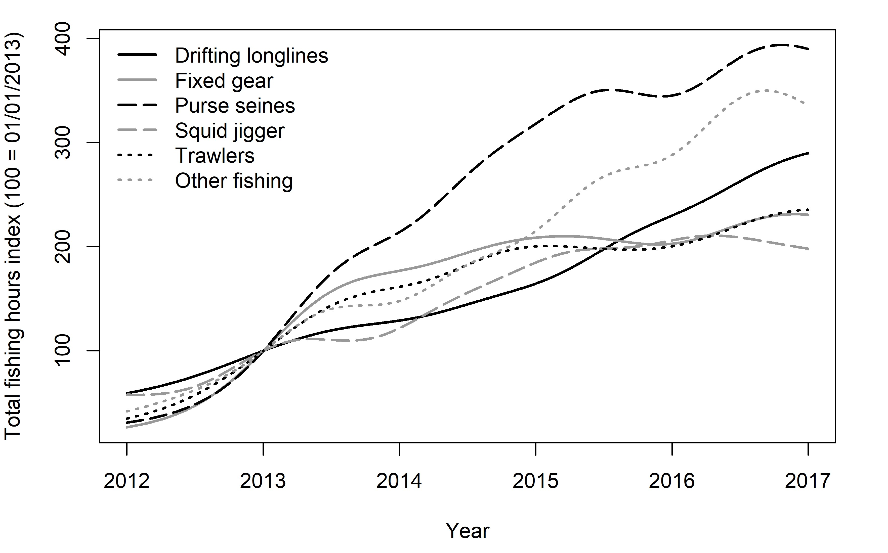
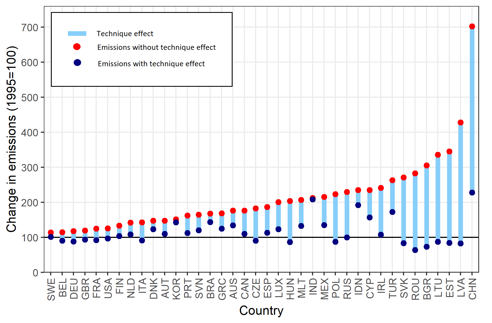

```{r setup, include=FALSE}
knitr::opts_chunk$set(echo = FALSE)
```


## Trade war

In 2019 there was a rapid escalation of trade tensions after Trump imposed tariffs aiming to punish China for its widening trade surplus vis-à-vis the Unites States. 
I made the following maps for the bank Pictet to illustrate the rapid progression of Chinese exports since its accession to WTO. China progressively becomes a bigger exporter than the United States in almost every market in the world.

Liz Faunce (Financial Times) compilled these maps into a gif and inserted them on an [article on this topic](https://www.ft.com/content/4975eb8a-0ab6-11ea-bb52-34c8d9dc6d84). To my surprise, a few months later it got selected among the FT [ten charts that tell the story of 2019](https://www.ft.com/content/62fbf660-2651-11ea-9a4f-963f0ec7e134).

```{r}

```


## COVID-19 decoupling

This charts shows the decoupling of COVID cases and deaths in the UK following the vaccination campaign of 2021. Until then, the death curve followed cases with an approximate lag of two weeks. Each spike in cases corresponded to a spike in deaths (very clear for the January 2021 spike). The mortality rate from COVID plummeted after vaccination roll-out. The July 2021 spike in COVID cases is not followed by a similar surge in the death curves.

```{r, fig.cap="COVID-19 deaths in London decouple from cases thanks to vaccination<br>Data source: Public Health England / Office of National Statistics"}
library(dygraphs)
library(dplyr)
months <- data.frame(name=c("January","February","March","April","May","June","July","August","September","October","November","December"), number = sprintf("%02d",seq(1,12)))

deaths <- read.csv("clean data/covid_ons_deaths_cqc_by_la.csv")
cases <- read.csv("clean data/covid_phe_cases_london_boroughs.csv")
cases <- cases %>% group_by(date) %>% summarise(new_cases = sum(new_cases),
                                                total_cases = sum(total_cases),
                                                .groups = "drop")
deaths <- deaths %>% filter(cause_of_death == "COVID 19") %>% group_by(date) %>%
          summarise(deaths = sum(deaths), .groups="drop")

corona <- full_join(cases,deaths, by="date")
corona <- corona %>% 
  mutate(new_cases = zoo::rollapplyr(new_cases, 7, mean, na.rm = TRUE, fill=NA),
         deaths = zoo::rollapplyr(deaths, 7, mean, na.rm = TRUE, fill=NA))
corona$date <- as.Date(corona$date)
corona <- as.data.frame(corona)
corona$total_cases <- NULL

corona <- xts::xts(corona[,2:3],order.by = corona[,1])

dygraph(corona, group="covid")%>% 
  dySeries("new_cases", label="New cases", strokeWidth = 2) %>%
  dySeries("deaths", axis = 'y2', label="Deaths", strokeWidth = 3) %>%
  dyOptions(colors = c("navy","firebrick"), fillGraph = TRUE, fillAlpha = 0.3, stepPlot = TRUE) %>%
  dyRangeSelector(dateWindow = c("2021-01-01", "2021-08-01")) %>%
  dyAxis("y", label = "New cases") %>%
  dyAxis("y2", label = "Deaths") 
```


## Fishing

The following two charts depict the increase in intensity of fishing activity. The first chart is based on some amazing data put together by [Global Fishing Watch](https://globalfishingwatch.org/). They trained a machine learning model to detect the amount of time and type of fishing activity in which vessels engage based on a combination of satellite and vessel tracking data. The image below shows the evolution of fishing hours for different fishing methods between 2012 and 2017. The second chart is based on FAO data of catches and shows that the global volume of catches has remained roughly stable since 1990. This slow down could be linked to the unsustainable level of fishing activity. FAO estimates that 94% of all fish stocks are currently overfished or fished at their maximum sustainable level.   

```{r, fig.cap="Fishing effort and total catches<br>Data source: Global Fishing Watch"}

```

```{r, fig.cap="Total global fishing catches<br>Data source: FAO"}
knitr::include_graphics("../../images/charts/total_catches.jpg")
```


## Financial shocks

These long time-series offer a snapshot of the number of financial crises in the world over the last 200 years. They show how financial shocks tend to be cyclical and globalisation lead to economies being synchronised across the world.

```{r, fig.cap="Financial cycles from 1800<br>Data source: Reinhart et al. (https://www.hbs.edu/behavioral-finance-and-financial-stability/data/Pages/global.aspx)"}

```


## Economic activity and carbon emissions

The next three charts are about carbon emissions and their link with economic activity. The first chart shows a breakdown of emission by production stage for some of the main food and agriculture products. The data comes from a metadata analysis conducted by [Nemecek and Poore (2018)](https://pubmed.ncbi.nlm.nih.gov/29853680/) and reveals a considerable heterogeneity across products. 


```{r, fig.cap="Breakdown of emissions from the food supply chain<br>Data source: Nemecek and Poore (2018)"}

```


The second chart shows the correlation between population and carbon emissions of European countries and is a reminder that we are all individually contributing to emissions. Countries above the trend line have a per capita consumption higher than the European average. 

```{r}

```

Finally, the third chart shows the key role played by technological innovation in curbing emissions. The chart illustrates growth in carbon emissions between 1995 and 2009 for a selection of countries and contrasts it to a scenario in which emission intensity remained constant. I used data from [GTAP](https://www.gtap.agecon.purdue.edu/) on emissions and production by ISIC sector to compute the two scenarios.

```{r, fig.cap="Growth of carbon emissions 1995-2009 with and without technological improvement<br>Data source: GTAP"}

```


## Conflicts in history

Another long time-series. This time showing the number of active conflicts around the world over the last 600 years. Conclusion: humans have never been a peaceful species.

```{r}

```


## Climate risks

Climate change will bring an increase in extreme weather events, such as droughts, cyclones and floods. These will constitute an increasing threat, especially for more vulnerable developing countries. The following charts illustrate the increase in average global temperatures, natural hazards and the uneven exposures of countries to climate risks.

```{r, fig.cap="Global warming<br>Data source: HadCRUT4 (https://www.metoffice.gov.uk/hadobs/hadcrut4/index.html)"}

```

```{r, fig.caption="Number of natural hazards by type<br>Data source: EM-DAT"}

```

```{r, layout="l-body outset", fig.cap="Exposure to natural hazards<br>Data source: World Risk Report 2020"}
library(data.table)
library(plotly)

df <- fread("clean data/WRI2020.csv", keepLeadingZeros = TRUE)

# light grey boundaries
l <- list(color = toRGB("Black"), width = 0.5)

# specify map projection/options
g <- list(
  showframe = TRUE,
  showcoastlines = TRUE,
  coastlinecolor = toRGB("grey"),
  projection = list(type = 'Mercator')
)


# BINNED WRI DATA

df$WRI <- ifelse(df$WorldRiskIndex>10.76, "very high",
                 ifelse(df$WorldRiskIndex>7.59,
                        "high",
                        ifelse(df$WorldRiskIndex>5.68, "medium",
                               ifelse(df$WorldRiskIndex>3.30,"low","very low"))))
df$WRI <-factor(df$WRI, levels=c("very low","low","medium","high","very high"))

color_scale <- data.frame(z=c(0,0.2,0.2,0.4,0.4,0.6,0.6,0.8,0.8,1),
                          col = c(rep("#FEFDB6",2),rep("#FFE402",2),rep("#FFA203",2),rep("#F90E1E",2), rep("#CB0033",2)))

#c(rep("#BFEF88",2),rep("#FFE402",2),rep("#FFA203",2),rep("#F90E1E",2), rep("#CB0033",2))

plot_ly(
  data = df[3:nrow(df),],
  type = "choropleth",
  locations = ~ ISO,
  z = ~ as.numeric(WRI),
  colorscale=color_scale,
  colorbar=list(tickvals=1:5, ticktext=c("very low","low","medium","high","very high"))
) %>% colorbar(title ="") %>% layout(geo = g)

```


## International environmental agreements

We often talk of large multilateral environmental agreements: the Paris Agreement, the Montreal Prorocol on ODS, etc.. However, this is only the tip of the iceberg. There are hundreds of active environmental agreements. Most of these agreements involve a smaller number of countries engaging over regional issues. The two following charts offer a breakdown of over 3000 environmental agreements (data from the [IEA database](https://iea.uoregon.edu/)).

```{r, fig.cap="International environmental agreements by subject<br>Data source: IEA Database Project (https://iea.uoregon.edu/)"}

```

```{r, fig.cap="International environmental agreements by year and type<br>Data source: IEA Database Project (https://iea.uoregon.edu/)"}

```


## Environmental policy

The following two charts are based on the [WTO environmental database](https://edb.wto.org/). This database tracks the environment-related measures notified to the WTO. It contains over 13000 measures and it is exceptional in its broad coverage of countries. As shown below, the number of notified environment-related measures is on the rise, but they are mostly being implemented in middle and high income countries. 

```{r, fig.cap="Number of environment-related measures notified to the WTO<br>Data source: WTO Environmental database (EDB)"}
knitr::include_graphics("../../images/map EDB measures.png")
```

```{r, fig.cap="Least developmed countries notify less environmental measures to the WTO<br>Data source: WTO Environmental database (EDB)"}

```


## Uncertainty

Uncertainty on economic policy has always been around. But the last two years have brought uncertainty to an all new level. This is exactly what [this](https://www.policyuncertainty.com/global_monthly.html) index suggests based on wording frequency in newspaper articles published around the world. 

```{r, fig.cap="Policy uncertainty following the 2019 trade tensions and COVID-19<br>Data source: Global Economic Policy Uncertainty Index"}

```


## Energy

We often give access to electricity as granted, but a large portion of the world population currently lives without electricity. The first charts illustrates the relationship between income and access to electricity. The second chart shows the recent boom in adoption of solar and wind technologies for electricity generation. Once again, poorer nations are lagging behind due to high switching costs. 

```{r, fig.cap="Electricity access vs income<br>Data source: World Bank<br>Notes: Each point correspond to a coutry in 2017."}

```

```{r, fig.cap="Uptake of solar and wind energy by income group<br>Data source: BP Statistical Review of World Energy, World Bank.<br>Notes: The figure shows GDP-weighted  average of the share of solar and wind energy in the electricity mic"}

```


