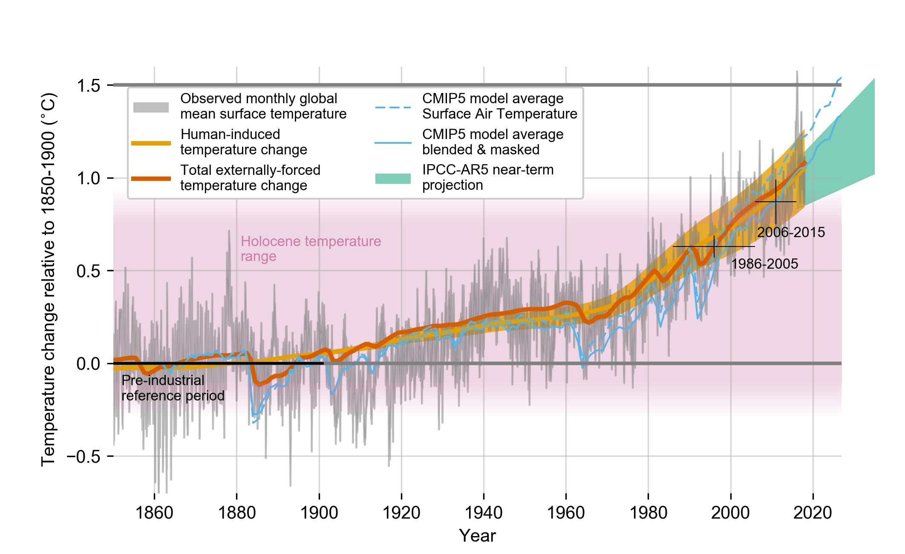
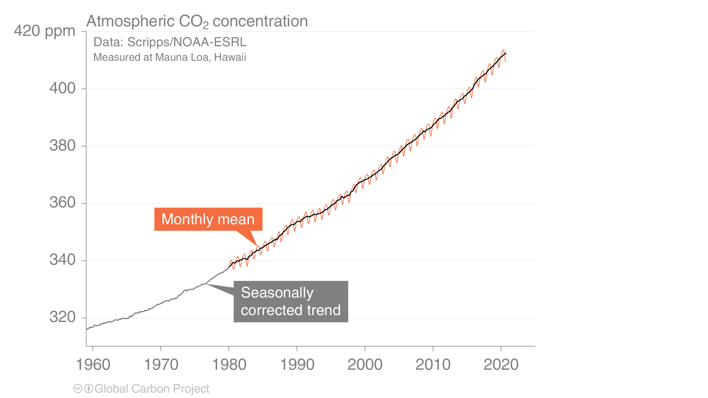
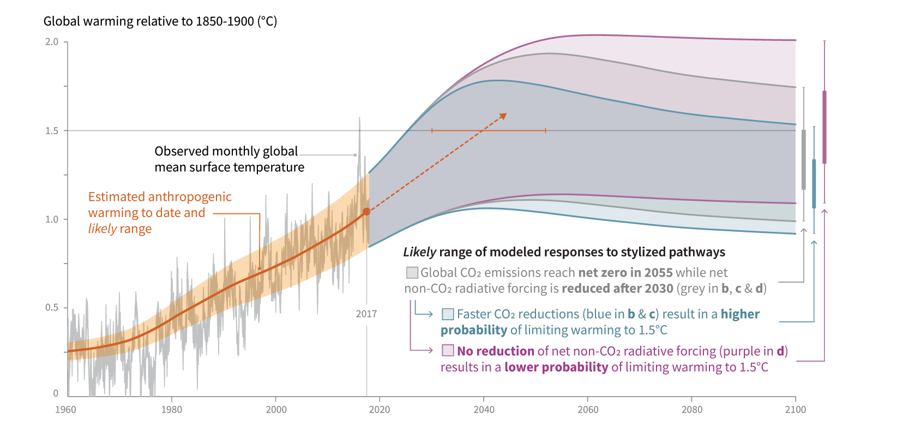
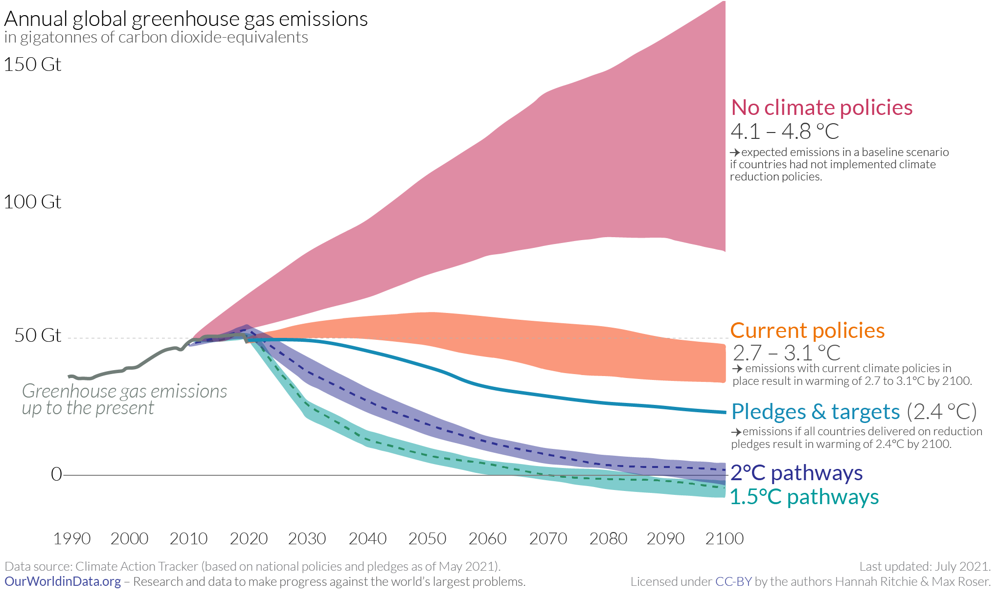

```{r setup, include=FALSE}
knitr::opts_chunk$set(echo = FALSE)
```


## What is the Paris agreement?

If you haven't heard of the Paris agreement you probably just came back from an interplanetary trip, awoke from hibernation experiment, or remained stranded on an island with no means of communication with the outside world for at least six years. So, let me congratulate you for making it here! We are happy to have you back! 

During your absence, country delegates gathered in Paris to sign a new agreement on climate change. Its goal is simply stated: limit the increase in average temperature to levels “well below 2°C above pre-industrial levels". While the goal is simply stated, it is not simply reached. Climate change has been called the biggest challenge that humanity has to face. 


## Wait … what is climate change?

If you haven't heard of this one, you might have been away longer than you think. Although I think you might have more pressing questions to attend, I won't leave a question unanswered: Climate change refers to a lasting change in the temperature and weather patterns around the world. A lot of human activities generate greenhouse gases (GHG), such as carbon dioxide or methane, which trap heat in the atmosphere. An increase as small as 2°C in global average temperature is enough to create disruptive changes around the world. Torrential rainfalls, severe droughts, food insecurity, melting glaciers, biodiversity loss, flooding and rise of sea levels are just some of the unpleasant events that scientists have associated with climate change. In short: climate change effects are bad, and the risks and costs associated with it are not fully understood. We should definitively try to avoid it! And that's what the Paris agreement is meant for. The idea is to avoid these catastrophic events by limit GHG emissions as much as possible and adapting to these changes. 


```{r, fig.cap="Temperature trend over the last 160 years <br>Source: IPCC 2019 special report on Global warming of 1.5°C"}

```


## Great! We got an agreement. Everything is fine then?

Alas, it's too early to celebrate. We already had two big agreements on climate change: the 1992 UN Framework Convention on Climate Change (UNFCCC), which established the institutions and principles for cooperation on climate change, and the 1997 Kyoto Protocol, which imposed binding emission reduction targets for a handful of developed nations. Yet, judging from the trend in CO$_2$ concentration in the figure below, they were not terribly effective at stopping climate change. If they had, we would not be writing about a third agreement on the same issue. 

```{r, fig.cap="CO2 concentration in the atmosphere <br>Source: Global Carbon Budget 2020"}

```


Admittedly, our track record is not exceptional. However, this time might be different. The Paris agreement started very well. The international community signalled a strong political engagement by allowing the Paris agreement to enter into force in 2016, just 30 days after it was open for signature --- this is impressive given that it took eight years for the ratification and entry into force of the Kyoto Protocol. A crucial role in its early adoption was played by the prompt ratification of the United States --- which later decided to pull-out of the agreement, and then again to rejoin it --- and China during a joint ceremony. These are the two biggest GHG emitters in the world. To date, 197 countries have signed the agreement, and 190 ratified it. What's more, the Paris agreements asks **all** its participants to contribute to reducing emissions by making pledges (more on this in a minute). This is essential because successful climate action requires global engagement and most of GHG emissions growth will take place in developing countries. 

We can call it a good start, but the truth is that all the work still lies ahead. The figure below shows the projected global warming in a scenario in which we reach net zero emissions by 2030 (resulting in 1.5°C warming) and by 2055 (2°C warming). Reaching net zero emissions means that, on balance, the amount of GHG released in the atmosphere needs to be no larger than the GHG removed from the atmosphere. Considering that we emit about 50bn tonnes of CO$_2$-equivalent GHG, this is no small task! And achieving neutrality before 2030 (or even 2055) is definitively a challenge. One thing is certain: the earlier we act, the more likely we are to succeed.


```{r, fig.cap="Paths towards Paris agreement's goal <br>Source: IPCC 2019 special report on Global warming of 1.5°C"}

```


## How does the Paris agreement work?

Overall the experience of the Kyoto Protocol was rather negative. Negotiations were arduous, the protocol engaged only a small number of countries, the entry into force was extremely slow, and its effectiveness in curbing emissions is debatable. Therefore, negotiators decided to opt for a totally different approach for the Paris Agreement. The system introduced by the Paris agreement consists of a structure divided in two layers:

1. A common binding ground that regulates the assessment process and basic formal requirements on accounting and communication of GHG emissions;
2. A flexible target setting for participants, in which each country is free to establish its objectives and the way it proposes to achieve them. The goals are called Nationally Determined Contribution (NDC). 

The agreement sets no binding emission targets for the participants and the ratifiers incur no sanction if they do not fulfil their NDC. However, the monitoring and reporting process is binding. In addition, every five years the parties must update their NCDs objectives, which must represent a progress toward the target of the agreement and reflect the “highest possible ambition” (Article 4, Paris Agreement). As of now, the reduction in emissions implied by the sum of all pledges is unable to ensure that the objective of “well below 2°C”is met (see Figure below). However, 2021 marks the fifth year from the entry into force of the agreement. Hence, it's now time to submit new, more ambitious pledges. Many of these new pledges have already been submitted in the past weeks. You can check out the [Climate action tracker](https://climateactiontracker.org/climate-target-update-tracker/) website for an overview of NDC submissions.

```{r, fig.cap="Current pledges fall short of Paris agreeement's target <br>Source: Our World in Data"}

```


Another feature of the Paris agreement is that it allows countries to pay for carbon emissions to be reduced abroad, the first country can count those reductions towards its own national targets. This should allow to cut the costs of climate action by curbing emissions where it is most efficient. Finally, the agreement also creates financial mechanisms to support developing countries in meeting their goals. In particular, developed nations promised to provide 100 billion dollars annually from 2020 to 2025 to support the agreement. 


## What is COP26 and why is it important?

Every year, the members to the UN Framework Convention on Climate Change and of the Paris agreement meet to assess their progress and take decisions regarding the implementation of the agreement. The fancy name of these meetings is "Conference of the Parties"  --- COP for short. This year's COP will take place in Glasgow and it is the 26th edition of COP (hence COP26).

This edition is important for multiple reasons. First, this edition marks five years from the entry into force of the agreement. Hence, we should expect new pledges and big announcements, which will provide a guidance for the next five years of implementation. Secondly, there are still some sticking points which need to be discussed.  For example, we are still a bit short of the 100bn rich countries had promised to provide by 2020 and members still need to define the highly contentious issue of how the carbon trading mechanisms will work in practice.
