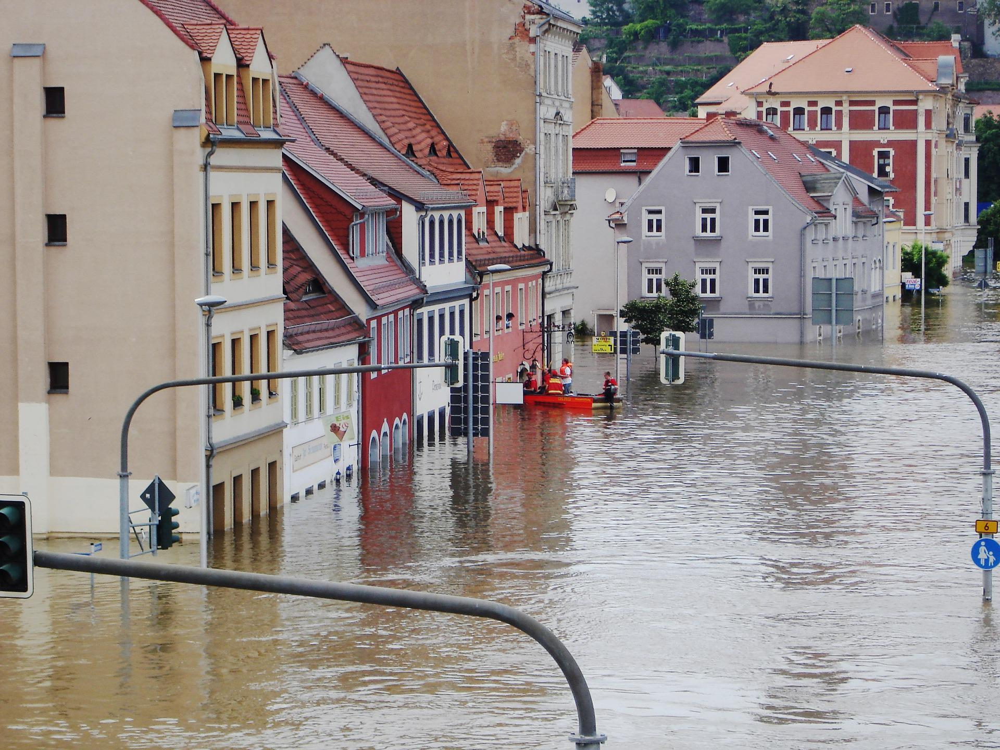
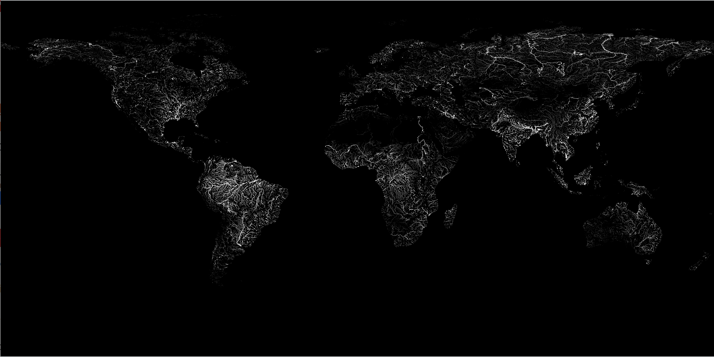

```{r, echo=FALSE} 

```

## First things first

The fundamental prerequisite for any risk exposure assessment is to have a list of assets for which we wish to conduct the analysis. As an illustrative purpose, we can imagine we have been tasked to analyse flood risk for presidential palaces around the world. This [Wikipedia](https://en.wikipedia.org/wiki/Presidential_palace) page provides a list of palaces names with the name of the city and country in which they are located. I extracted, cleaned and saved the information of 143 presidential palaces in a `csv` file, which can be downloaded [here](https://fbellelli.com/posts/natural-hazard-risk-analysis-in-r/presidential-palaces_geocoded_with_risk.csv) to follow along with the example.

```{r}
#load list of palaces
palaces <- read.csv("presidential_palaces_geocoded_with_risk.csv", encoding="UTF-8")
```


## Geocoding

Once we have a collection of asset, the first step is to convert addresses into latitude and longitude coordinates --- this operation is known as **geocoding**. Geocoding is important because it gives geographic coordinates that are easily interpretable by a computer. This will allow to place our assets on a map and extract information on flood risks.

Geocoding is usually performed with an API (e.g. Google maps, OpenStreetMap, ...) that takes *in* addresses and spits *out* coordinates. Nowadays, these APIs require the user to provide keys in order to limit the number of requests. Here is a list of the most common packages for doing this in R:

- `ggmap`
- `nominatimlite`
- `osmdata`
- `tidygeocoder`

Attentive readers, might have noticed that we already provided longitude and latitudes in the example file. We got these coordinates with the following code.

```{r eval=FALSE}
library(ggmap)

# insert personal google API key - this requires registration 
register_google(key="WRITE YOUR KEY HERE")

#geocode addresses
geo <- geocode(paste0(palaces$Building,", ",palaces$Country))

#import geocodes in table
palaces <- cbind(palaces,geo)
```

Now that we have the coordinates of the palaces, we can easily place them on an interactive map with the package `leaflet`. The names of the palaces can be visualised by hovering over the markers.


```{r}

library(leaflet)

leaflet(palaces) %>%
  addTiles() %>%  
  addMarkers(lng= ~ lon, lat= ~ lat, label= ~ Building)

```


```{r eval=FALSE, include= FALSE}
#this is an alternative interactive plot. Not included because more complex code
library(sf)
library(ggplot2)
library(plotly)
countries <- st_read("../../files/World_Countries/World_Countries.shp")
map <- ggplot()+
  geom_sf(data=countries)+
  geom_sf(data=st_as_sf(palaces, coords=c("lon","lat"), crs="WGS84"),
          col="red",
          mapping=aes(label=Building))+
  theme_bw()
ggplotly(map)

```


## How to find out information on flood risk

The goal of our analysis is to obtain information on the risk exposure of different assets. The easiest way to get it, is to refer to **hazard maps**.  Hazard maps are maps which identify areas that are vulnerable to a particular hazard. They are built by experts based on geophysical modelling that incorporate all the main factors affecting hazard exposure. Many government agency across the world build hazard maps to manage risk in their countries. For instance, in the Unites States, the reference flood hazard map is the one from the Federal Emergency Management Agency (FEMA).  

### Loading hazard maps

In this example, we will use the **riverine flood maps** from **[Acqueduct](https://www.wri.org/data/aqueduct-floods-hazard-maps)**, which have a resolution of 30 arc second (roughly 1km at the equator). Although higher granularity may be advisable for flood assessment, Acqueduct maps have the advantages of being publicly available, having a global coverage and having projections under different climate scenarios.

Acqueduct flood maps are available for different **return periods** (2, 5, 10, 25, ..., 1000 years). Return periods are the inverse of probabilities. For instance, a 1 in 100 year flood is a flood of such intensity that it will be equalled or exceeded on average once every 100 years, i.e. a flood which has a 1% probability of occurring in a given year. 

For each return period, Aqueduct's flood map display the expected inundation depth (in meters). In other words, Aqueduct provides a set of flood map which give slices of the probability-depth joint distribution. The beautiful figure below illustrates how these maps look like. Lighter colours indicate inundated areas in the event of a 1 in 500 years flood. Understandibly, the map shows that areas around rivers are  at higher risk of riverine floods and quantifies the severity of this risk in term of inundation depth.

```{r,echo=FALSE, layout="l-screen", fig.cap="Aqueduct riverine historical flood map - 500 year return period"}


```


Acqueduct flood maps come as raster files (`.tif`), in which each pixel encodes the expected inundation depth. We can use the package `terra` to work with this type of data in R. Let's load the map with the following command 

```{r eval=FALSE}
library(terra)

#path to Aqueduct hazard map - riverine flooding (100 years return period) 
map_path <- "http://wri-projects.s3.amazonaws.com/AqueductFloodTool/download/v2/inunriver_historical_000000000WATCH_1980_rp00100.tif"

#load hazard map in R
rflood100 <- terra::rast(map_path)
```

Notice that vector data (e.g. `.shp`, `GeoJSON`) are also a common formats for hazard maps. In vector formats the information is attached to polygons instead of pixels. For manipulating vector spatial data, the package `sf` is my favourite alternative. Vector data can be loaded with the functions `sf::read_sf()` or `terra::vect()`. Vector spatial data could be the subject of another post.

### A brief note on coordinate systems

Spatial data often comes with information on the underlying coordinate system and map projections. Computers programmes will often be able to read these information and automatically convert it as needed. However, it might occasionally be necessary to specify manually this information. For example, if we wish to indicate that our `lat` and `long` columns correspond to the latitude and longitude commonly used in the real world by GPS systems or to perform changes of coordinates for mapping. 

Therefire, it might be useful to know that latitude and longitude of points of assets and polygons are very often expressed in the [World Geodesic System of 1984](https://en.wikipedia.org/wiki/World_Geodetic_System) (**WGS84**) and that rasterised maps normally use an [equirectangular projection](https://en.wikipedia.org/wiki/Equirectangular_projection) because this projections maps the surface of the earth onto a grid, thus it can be easily linked to the pixels of an image.

That being said, this topic is way to vast to fit in this article and my limited knowledge would not do justice to this fascinating corpus of scientific work. The issues associated with coordinate system, projections and their distortions kept bright human minds busy for centuries. I highly recommend [this series of articles](https://www.icsm.gov.au/education/fundamentals-mapping/overview-fundamentals-mapping) from the Australian and New Zealand Spatial Information Council for a wonderfully written introduction on all these mapping topics.  


## Extracting flood risk information

Now that we have hazard maps with flood risk information and geocoded asset locations, all that is left to do is to extract information for our locations of interest.  

### Intersecting asset location with hazard maps

We can use the same package, `terra`, to perform this operation with one line of code. First, we declare the columns `lon` and `lat` as coordinates for the palaces position. Then, we use the function `extract` to extract information from the flood map for our list of presidential palaces. Finally, we save the results in the palaces table.  

```{r eval=FALSE}
#convert palaces into vector points
palaces_vect <- terra::vect(palaces, geom=c("lon","lat"))

#extract information for palaces
temp <- terra::extract(rflood100, palaces_vect) 

#save extracted information in palaces table
palaces$flood <- temp[,2]
```


Citizens around the world will be pleased to hear that most palaces around the world are not at risk of getting flooded.  In the following table we list the top ten palaces in which leaders are most likely to get their feet wet in case of a 1 in a 100 year flood. Only three palaces have a flooding depth higher than 1m, which could be considered as an extreme flood.

```{r, echo=FALSE, eval=TRUE}
library(dplyr)
palaces %>% 
  arrange(desc(flood0100)) %>% 
  select(Country, Building, flood0100) %>% 
  mutate(flood0100=round(flood0100,1)) %>%
  head(10) %>% 
  rename("Flood depth (m)"=flood0100) %>%
  knitr::kable(., 
               caption="Ten worst flooded palaces in case of a 1 in 100 year flood",
               align=c("l","l","c"))
```


### Extracting flood depth for multiple return periods

Now that we know how information can be extracted, we can repeat the procedure for different return periods so as to have a complete picture of the distribution for different flood severity. This is time-consuming step, hence, I already included the results in the [example data](https://fbellelli.com/posts/2022-05-22-a-brief-introduction-to-natural-hazard-risk-analysis/presidential_palaces_geocoded_with_risk.csv).


```{r eval=FALSE}
#convert palaces into vector points
palaces_vect <- terra::vect(palaces, geom=c("lon","lat"))

#loop over all return periods
for (i in c("0002","0005","0010","0025","0050","0100","0250","0500","1000")){
  
  # prepare path to hazard map
  map_path <- paste0("http://wri-projects.s3.amazonaws.com/AqueductFloodTool/download/v2/inunriver_historical_000000000WATCH_1980_rp0",i,".tif")

  #load map  
  flood <- terra::rast(map_path)
  
  #extract information
  temp <- terra::extract(flood, palaces_vect)
  
  #save information in palaces table
  palaces[,paste0("flood",i)] <- temp[,2]
}
```


Having the full distribution of probability-depth of flooding allows to make some interesting comparisons. The next graph shows the risk profile of the three properties with the highest flooding risk. 

We can see that Villa Hammerschmidt (Bonn) has 10% (1/10 yr) probability of having a 1 meter flood, while the presidential palaces in Karthoum has around 3% (1/33 yr) of experiencing a flood with similar depth levels.

Overall, it appears that Villa Hammerschmidt (Bonn) is more likely to get flooded regularly, while the presidential palace in Karthoum has lower flood probabilities, but it has higher expected flood depth in case of extreme floods (1 in 100 year or higher). Finally the presidential palace in Libreville has higher expected flooding levels for all return periods.

```{r, echo=FALSE, fig.cap="Probability-depth distribution for the three most exposed palaces"}
library(ggplot2)
library(tidyr)

temp <- palaces[c(14,32,122),grepl("(Building)|(flood\\d{4})",colnames(palaces), perl=TRUE)] %>% 
  pivot_longer(cols=!Building, names_to="Return period (yr)", values_to = "Flood depth (m)") %>%
  mutate(`Return period (yr)`= as.factor(as.numeric(substr(`Return period (yr)`, 6,10))))

ggplot(temp, aes(x=`Return period (yr)`, y=`Flood depth (m)`, group= Building, colour=Building))+
  geom_line(size=1.5)+
  scale_y_continuous(expand = c(0,0), limits=c(0,5))+
  theme_bw()+
  theme(legend.position=c(0.2,0.8),
        legend.background = element_rect(fill = "white", color = "black"))+
  geom_hline(yintercept=1, linetype=2)

```


### Expected flooding levels

Having the full probability-severity distribution allows for a greater richness of details. However, sometimes it is handy to have a single metric that encapsulates the risk profile of an asset. To do this, we can calculate the annualised expected flood level by summing over the flood depths weighted by their probabilities (inverse of return period).

$$ 
E[\text{Flooding}]_i = \sum^{n}_{j=1}\frac{1}{RP_{j}}\cdot Depth_{ij}
$$

Where, $i$ is an index for the asset and $j$ an index for the $n$ available return periods. So that $RP_{j}$ indicates the return period associated with the $j$-th index and $Depth_{ij}$ indicates the depth level expected for asset $i$ with return period $RP_{j}$. We can implement this calculation in R by using the `dplyr`and `tidyr`packages.

```{r}
library(dplyr)
library(tidyr)

#tidying up the table into a long format (this facilitates calculations in R)
long_table <- palaces %>%
  pivot_longer(cols=starts_with("flood"),
               names_to = "return_period",
               values_to = "flood_depth") %>%
  mutate(return_period = as.numeric(substr(return_period, 6,10)))

#calculating the expected flood level
risk_table <- long_table %>%
  mutate(probability = 1/return_period,
         expected_flood = probability * flood_depth) %>%
  group_by(Building) %>%
  summarise(expected_flood = sum(expected_flood), .groups="drop")


```

We can then rank the palaces according to this metric. We find that the Presidential palace in Libreville and the Villa Hammerschmidt (Bonn) are the palaces at greater risk of riverine flooding in our sample. It is plausible that these palaces are at high flood risk, the presidential palace in Libreville is located just next to the sea, and villa Hammerschmidt is built on the shores of the Rhine, as shown in the map below. However, the depth levels seems suspiciously high, it would be advisable to use alternative maps (possibly with higher granularity) to double-check these numbers. Perhaps the map used here do not take into account flood defences that were built to prevent regular flooding.  

```{r, echo=FALSE, eval=TRUE}
risk_table %>%
  arrange(desc(expected_flood)) %>%
  mutate(expected_flood = expected_flood *100) %>%
  head(10) %>%
  knitr::kable(., 
               caption="The ten palaces at highest flooding risk",
               align=c("l","c"),
               col.names = c("Bulding","Annualised expected flood level (cm)"),
               digits=0)
```


```{r, echo=FALSE}

library(leaflet)

leaflet(palaces[palaces$Building=="Villa Hammerschmidt, Bonn",]) %>%
  addTiles() %>%  
  addMarkers(lng= ~ lon, lat= ~ lat, label= ~ Building)

```


## Converting hazard distributions into expected damages

So far, the analysis has concentrated on quantifying the exposure to physical risks. Next, we might want to convert this exposure into expected damages to our assets. **Damage curves** are the standard tool applied to achieve this. 

### Damage curves

Damage curves, also vulnerability functions, are curves mapping the intensity of an hazard to the expected damage to an asset, which is typically expressed as a damage ratio  --- i.e. percentage of  asset construction value that is lost. These curves are usually estimated from historical damage data.

The actual damage incurred by an asset will depend on a multitude of factors. For example, in the case of a riverine flood, we can immagine that the presence of basement, the height of the house floor, number of floors, materials, construction methods, whether preventive measure have been taken, etc., are all factors that will modify the impact of flooding on the property. 

Therefore, **there is no there is no universal damage curve that can be applied to all types of assets**. Usually, different damage curves are devised according to key characteristics of the assets, such as material, construction techniques, positioning, orientation, shape, height, layout, number of windows, etc. This will allow to get a more accurate estimate of the effective hazard damages.

Nevertheless, for the sake of this example, let's keep things simple and assume a unique damage curve is representative for all presidential palaces. We will take an average damage curves without worrying too much about construction specifications. In the figure below, I plotted average damages curves developed in [this research paper of the JRC (European Commission)](https://publications.jrc.ec.europa.eu/repository/handle/JRC105688) for different regions of the World. If you wish to download the curves used in this example, a cleaned version of the data is available  
[here](https://fbellelli.com/posts/natural-hazard-risk-analysis-in-r/flood_damage_curve_residential_buldings.csv).


```{r, echo=FALSE}
#load list of palaces
damage_curve <- read.csv("flood_damage_curve_residential_buildings.csv")
```


```{r, echo=FALSE}
damage_curve %>% 
  pivot_longer(!FloodDepth, names_to="Region", values_to="DamageRatio") %>%

ggplot( aes(x=FloodDepth, y=DamageRatio, linetype=Region, colour=Region))+
  geom_line(size=1.2)+
  scale_linetype_manual(values=c("Europe"=1,"NorthAmerica"=1,"CentralSouthAmerica"=3,"Asia"=3,"Africa"=1,"Oceania"=3))+
  scale_colour_manual(values=c("Europe"="blue","NorthAmerica"="red","CentralSouthAmerica"="red","Asia"="blue","Africa"="green3","Oceania"="green3"))+
  theme_bw()+
  xlab("Flood depth (m)")+
  ylab("Damage ratio (%)")

```

From the figure, it can be seen that on average building in Central and South America are more vulnerable than buildings in Asia. For the same inundation levels (x-axis), a higher damage ratio is expected (y-axis). 

In order to keep things simple, this example will only keep the European damage curve and apply it to all presidential palaces, irrespectively of their location. This choice is completely arbitrary. I chose to keep the European curve because it is the one which associates the lowest expected damages to floods. This selection is based on the criterion that presidential palaces are likely to be built with high specifications and usually undergo constant checks and maintenance. In any case, the purpose of this example is to illustrate to general process rather giving exact damage figures.

```{r}
#load list of palaces
damage_curve <- read.csv("flood_damage_curve_residential_buildings.csv")

#Keep only the European curve and rename it
damage_curve <- damage_curve[,c("FloodDepth","Europe")]
colnames(damage_curve)[2] <- "DamageRatio"
```

### Calculating expected damages

The original damage curves in the JRC paper are defined by 9 flood depth points (0, 0.5, 1, ..., 6). In order to get estimates for intermediate values (e.g. 0.3m of flooding) we can interpolate the damage ratios between these points. With the following code, I build a table that summarises the damage curve with a bit more granularity.  

```{r}
interpolated_damage_curve <- data.frame(FloodDepth=seq(0,6,0.1))
interpolated_damage_curve <- left_join(interpolated_damage_curve, damage_curve, by="FloodDepth")

library(zoo)
interpolated_damage_curve <- interpolated_damage_curve %>%
  zoo(.)%>%
  apply(., MARGIN = 2, FUN = zoo::na.approx) %>%
  as.data.frame()

```

Now that we have a nice summary table, we can easily import the expected damage ratio for each presidential palaces by matching the expected flooding level under different return periods with the ones in the interpolated damage curve table.


```{r}
#In the data frame long table, each entry correspond to an asset-return period combination

#merging is done on the rounded expected flood depth (converted to character to facilitate merging and avoid problems associated with floating point numbers)
long_table$rounded_flood_depth <- as.character(round(long_table$flood_depth,1))
interpolated_damage_curve$FloodDepth <- as.character(interpolated_damage_curve$FloodDepth)
long_table <- dplyr::left_join(long_table,interpolated_damage_curve,by=c("rounded_flood_depth"="FloodDepth"))
```


Then, we can proceed to calculating the expected damage ratio for the presidential palaces by taking a weighted average of the damage ratios over each return period. 

$$ 
E[\text{Damage}]_i = \sum^{n}_{j=1}\frac{1}{RP_{j}}\cdot Depth_{ij}\cdot DR_{ij}
$$

This formula is nearly identical to the one used for the average flood level, the only addition is the term $DR_{ij}$, which indicates the damage ratio incurred by the palace $i$ in case of a flood with depth $Depth_{ij}$. We can easily calculate this in R as follows:


```{r}

#calculating the expected flood level
damage_table <- long_table %>%
  mutate(probability = 1/return_period,
         expected_flood_damage = probability * flood_depth * DamageRatio) %>%
  group_by(Building) %>%
  summarise(expected_flood_damage = sum(expected_flood_damage), .groups="drop")
```


The table below lists the palaces that have the highest expected flood damage. As we already mentioned before, the results for the first three palaces seems suspiciously high --- if the 28.3% expected annual damage from flood were an accurate figure, fisheries would be a more fitting allocation of the grounds of Gabon's Presidential palaces. It would be advisable to use alternative maps (possibly with higher granularity) to double-check these numbers. Also, there might be preventive measures in place that the maps do not take into account (e.g. embankments) that can explain this resul.   

```{r}
damage_table %>% 
  arrange(desc(expected_flood_damage))%>%
  head(10) %>%
  mutate(expected_flood_damage=100*expected_flood_damage)%>%
  knitr::kable(., 
               caption="The ten palaces with the highest expected flooding damages",
               align=c("l","c"),
               col.names=c("Palace", "Annualised expected damage (%)"),
               digits=1)
```

## Climate change: the elephant in the room

The entire analysis we conducted to this point ignores once crucial element: **climate change**. Because of it, extreme weather patterns are predicted to become more frequent and intense in most places around the globe. Hence, risk analyses should take this into account.

Most hazard maps are based on historical data --- they are *backward looking* by construction. The problem is that past occurrences might not be representative of future risk if the underlying climate is changing. The solution is using maps that incorporate the changes in risk due to climate change patterns. Climate models are used to predict how extreme weather events will change in the future under different emission scenarios. 

The problem of these climate models is that they have inherent uncertainty in predicting complex system over long horizon. Therefore, estimates may come with large uncertainty bands and vary between models. Moreover, Many of these models have low spatial granularity, therefore results may be too coarse to be translated into risk maps. Nevertheless, there is much research going on in this area and our understanding and tools will certainly get better in the near future.

I would like to mention that the **[Acqueduct](https://www.wri.org/data/aqueduct-floods-hazard-maps)** flood maps are available also under two different climate scenarios (RCP4.5 and RCP8.5) with prediction from four different climate models. Dear reader, a perfect exercise to test your understanding would be to replicate this analysis with one of the hazard maps under the RCP8.5 scenario (corresponding to a pessimistic, business as usual concentration pathway) and compare the results to the ones obtained here with historic data. How do results change for our list of presidential palaces? You should find an increase in flood risk and expected flood damages.


