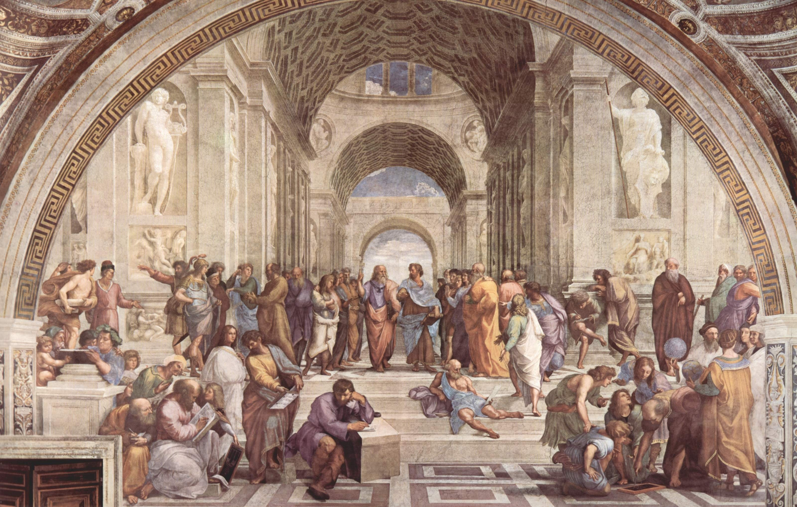

```{r setup, include=FALSE}
knitr::opts_chunk$set(echo = FALSE)
```


```{r, fig.align="center", fig.cap="Night view of Saint Peter's cupola<br>Source: Julius Silver (Pexels)"}
knitr::include_graphics("cupolone.jpg")
```


## Some interesting facts

Let's start with a few interesting facts about Rome to stimulate your travelling appetite.

There are more [ancient Egyptian obelisks](https://en.wikipedia.org/wiki/List_of_Egyptian_obelisks) standing in Rome than in the whole of Egypt. That’s mainly because the Roman emperor liked them a lot, so they brought a few back to the capital as souvenir.

Rome is also the city with the most fountains in the world. Most of them are pretty nice too.

Perhaps unsurprisingly, Rome is also the city with the highest number of historical churches. You’ll see churches everywhere. And most of them are quite impressive and lavishly decorated on the inside.  Also, Saint Peter basilica is one of the largest churches in the world.  

Rome is nicknamed “the eternal city”. It is very old, according to legend, Rome was funded in 753BC, but there is evidence of older settlements.

Rome is also considered a romantic city. Obviously, the fact that the word ROMAntic comes from ROME plays a role. Also, in Latin if you read the name of ROMA backward, it spells AMOR, which means love.

The Vatican is the smallest country in the world (44 sq km). It is entirely enclosed within the city centre of Rome. Not many people know that there is a second piece of land which has extraterritorial status in Rome: it is the [Sovereign Order of Malta’s headquarters](https://en.wikipedia.org/wiki/Sovereign_Military_Order_of_Malta). It’s a strange organization: It is not a country, but it can  issue its own passports. 


## The most popular sites

I don't know why, but most of the travellers to Rome tend to book only three days. That is much less than what is actually needed to tour the city: you will be rushing around all day and still miss so many great things! I think at least five days are required, but since three days is the norm, I split the most famous attractions in three days (the ones every tourist goes to) and listed the other attractions, less touristic but equally nice, and which you will probably not have the time to visit, in the next section. For your reference, I added a map at the end of this section.  


```{r, fig.align="center", fig.cap="The school of Athens (Raphael)"}

```


### Day 1: Vatican

#### Saint Peter basilica (San Pietro)
Entrance to the church is free, but expect very long queues (1h of wait is not uncommon)!  Also, keep in mind that on Sundays there is a mass in the big square given by the pope, so I think you can’t visit inside in the morning. Around Christmas you’ll also see a big Christmas tree and nativity. 

You can also climb to the top of the *cupola*, which is the highest building in Rome. This requires a ticket, but I highly recommend it if it is a nice day.

#### Vatican Museums (Musei Vaticani)
Inside you will find many famous artworks, including the Sistine chapel (Michelangelo)  and school of Athens (Raffaello / Raphael).  Again, the queue is super long! I advise you to buy the tickets online in advance so that you can skip the ticket office queue.


#### Saint Angel Castle (Castel Sant’Angelo)
The castle of the Popes. It only served a couple of times for defence. In case of emergency the Pope can walk over the walls from its apartments (next to Saint Peter square) all the way to the castle. Oddly, the castle was built on top of Hadrian’s tomb,  a Roman emperor. If you visit, you can see the different historical layers. Requires a ticket to visit.


```{r, fig.align="center", fig.cap="Fontana di Trevi<br>Source: [Pexels](https://www.pexels.com/photo/sculptures-on-a-water-fountain-in-front-of-a-building-7355954/)"}
knitr::include_graphics("fontana_trevi.jpg")
```


### Day 2: City centre

#### Pantheon
An architectural masterpiece built by the Romans. Still standing and currently used as church. Entrance is free. The dome was the largest in the world for thousand of years. If it looks familiar it’ because it inspired many buildings across the world.

#### Navona square (Piazza Navona)
This is a very nice square. There are two famous fountains and around christmas it hosts Rome’s traditional Christmas market.

#### Trevi Fountain (Fontana di Trevi)
The famous fountain where people throw coins. It’s usually very crowded! It’s also nice at night because of the lighting. 

#### Campo de’Fiori
Another nice square nearby. 

#### High streets of Rome
The triangle between **Piazza del Popolo**, **Piazza Venezia** and **Piazza di Spagna** is where most high street shops are located (Via del Corso and Via Condotti). I suggest you have a walk around and check the three squares I just mentioned. Also, when you go to Piazza del Popolo, make sure to climb up to the **Pincio** for a bit of a view.


```{r, fig.align="center", fig.cap="Colosseo<br>Source: Riccardo Bertolo (Pexels)"}
knitr::include_graphics("colosseo.jpg")
```


### DAY 3 ANCIENT ROME

#### Forum / Coliseum (Foro / Colosseo)
Again, you will find long queues here. My advice is to buy the tickets at the entrance of the forum, because less people visit there but the ticket is the same (also, I recall the ticket is valid for 2 days).  

#### Capitol (Campidoglio)
According to legend, the capitol hill is where Rome was founded. It has a special place in Roman history and it hosts the townhall of Rome since 1144 (obviously, this is where the name Washington's capitol comes from). The square on top was designed by Michelangelo. On top of the hill there is also a nice church (Ara Cealis) and the Musei Capitolini. This is the oldest public museum in the world. It houses some famous Roman statues (e.g. Roman bronze statue of the she wolf feeding Romulus and Remus).

#### Altare della patria 
You won’t miss it, it’s the big white building next to the square Piazza Venezia with a large Italian flags on top. The building was built by Mussolini to celebrate soldiers who died in WWI. Piazza Venezia is also the place where Mussolini was giving public speeches.


```{r, fig.align="center", layout="l-page", fig.cap="Main sites in Rome<br>Source: Michelin green guide of Italy"}
knitr::include_graphics("map_rome_michelin.jpg")
```


## Other important sites


Here is a list of a few more nice  places in case you have time or happen to be close to it. Even with these, you would just be scratching the surface, there are a lot more places to visit in Rome. A common saying in Rome is that a lifetime would not be enough to view it all!


```{r, fig.align="center", fig.cap="Interiors of Basilica of Saint Paul Outside the Walls<br>Source: Wikipedia"}

```


#### Other important churches

* Basilica di San Giovanni (Sanctum sanctorum) - This is actually the real headquarters of the Roman Chatolic church. The obelisk in front of the church is the tallest in the world.
* Basilica di Santa Maria Maggiore 
* Chiesa cappuccini - This church has a crypt full of monk’s skulls (like the one in Paris)
* Santa Maria in Cosmedin (Bocca della verità)
* San Luigi dei Francesi
* Santa Maria Trastevere


```{r, fig.align="center" ,fig.cap="Resting boxer, 2nd-3d century BC (Palazzo Massimo)<br>Source: Wikipedia"}

```


#### Museums
* Palazzo Massimo, museo nazionale romano - I love this museum. It hosts the best Roman art I have ever seen. The mosaics are just unbelievable. If you have time, go! (it is usually less crowded than other sites)
* Galleria colonna
* Palazzo Barberini
* Galleria Borghese
* Villa Torlonia


```{r, fig.align="center", fig.cap="Cestius' Pyramid<br>Source: Wikipedia"}

```


#### Other famous sites
* Quirinale - the palace of the president. It is 30 times larger than the white house and a lot older and nicer inside! You can only visit with guided tours. Requires booking in advance.
* Terme di Caracalla - Ruins of an ancient bathhouse
* Ara Pacis - Shrine to peace constructed by emperor Augustus. It’s beautifully preserved, very nice carvings. It’s normally not too crowded because it requires a ticket to enter. In my opinion it is worth a quick stop if you are nearby.
* Via Appia - Roman cobblestone road lined with ancient tombs. Good for hiking. Passes next to some an ancient Roman aqueduct.
* Piramide - A marble pyramid built by a Roman general. Just next to it, there is the protestant cemetery of Rome, where you can find the famous [Angel of grief](https://en.wikipedia.org/wiki/Angel_of_Grief) statue.
* Catacombs - underground network of tunnels used by Christian when they were persecuted by Roman emperors
* Villa Borghese - LArge park in the city centre of Rome. As the name suggests, It used to be part of the Borghese’s family villa. Now it’s public.
* EUR - Neighborhood built by Mussolini for the Olympic games (which finally never took place because of the war). It’s an interesting place to see the Fascist architectural style. 
* Domus Aurea - Roman ruins of ancient empial palace
* Circo Massimo - Location where ancient romans used to organise charriot races. Not much is left, but the indentation in the ground is still visibile. 


#### Panoramic views

* Gianicolo
* Aventino / Villa del Priorato di Malta (famous keyhole view)


```{r, fig.align="center", fig.cap="Keyhole view from the Villa del Priorato di Malta <br>Source: Wikipedia"}
knitr::include_graphics("keyhole.jpg")
```


## Typical dishes from Rome

Rome has many typical dishes. It’s culinary tradition comes from poor shepherds’ traditions, with abundant use of pork/lamb and less prestigious meat cuts. It’s a bit on the “heavy” side.


#### Pasta
* Carbonara - egg, cheese, pork, black pepper
* Cacio e pepe - cheese and balck pepper
* Amatriciana - onion, tomato and pork
* Gricia - lard and pork
* Gnocchi alla romana - semolina gnocchi
* Arrabbiata - tomato and chilli 

#### Meat
* Porchetta - roasted pork, usually served in sandwiches
* Coda alla vaccinara - oxtail stew
* Saltimbocca alla Romana - veal + slice of ham + sage
* Abbacchio scottadito - roasted lamb chops
* Coratella / pajata - stews made of assorted lamb innards
* Pollo ai peperoni alla romana - chicken with bell peppers
* Trippa alla romana - tripe 


#### Vegetables / Sides 
* Carciofi alla romana / carciofi alla giudea - artichokle
* Puntarelle / cicoria alla romana - Greens, usually cooked with garlic and chilli 
* Zucchine romanesche - A type of courgette common in Rome, sweeter with lighter colour
* Broccoli romaneschi - roman broccoli


#### Starters
* Suppli - fried rice ball with cheese
* Fiori di zucca - Fried courgette flowers filled with anchovies and cheese


```{r, fig.align="center",, fig.cap="Restaurant in the city centre<br>Source: Fineas Anton (Pexels)"}
knitr::include_graphics("ristorante.jpg")
```


## Eating places

I am not very good because I have been away for a while, but here a few I can recommend:


#### Ice cream (Gelato)
* [Old Bridge](https://goo.gl/maps/nGVbqSrqsD5XvCMe6) - small shop just next to the vatican. You often see nuns and priest queuing up 
* [Giolitti](https://goo.gl/maps/zyBQWNk7mWQtF1WCA) - in the city centre 
* Venchi - many shops across the city

#### Restaurants for typical dishes
These are popular places, they will require booking in advance
[Luciano cucina italiana](https://goo.gl/maps/WRwMEd3vPTxCckd47), [Sora Lella](https://goo.gl/maps/j4A2w5nBagemBBiAA), [Armando al Pantheon](https://goo.gl/maps/xLk4FJYVC4wxchMD6), [Osteria al Grappolo d’oro](https://goo.gl/maps/qiGRHLGiDf2uhbU78), [Osteria della trippa](https://goo.gl/maps/4kkG6MBBRWhgv2w16), [Poldo e Gianna](https://goo.gl/maps/35K1i8BMiddhL8P56).

#### Best espresso in Rome (supposedly)
[Caffè Sant'Eustachio](https://goo.gl/maps/pdxExweUSQAjK5QF9)


