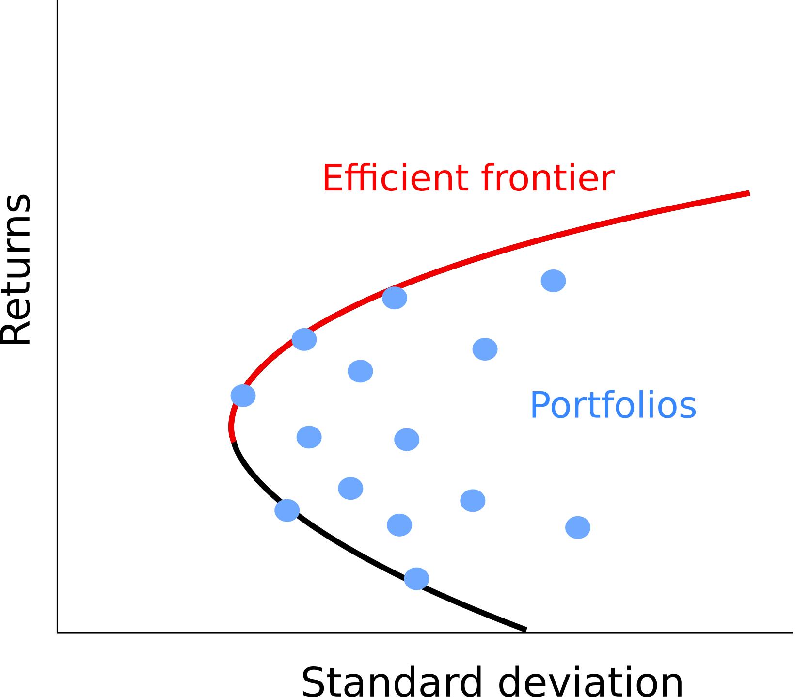
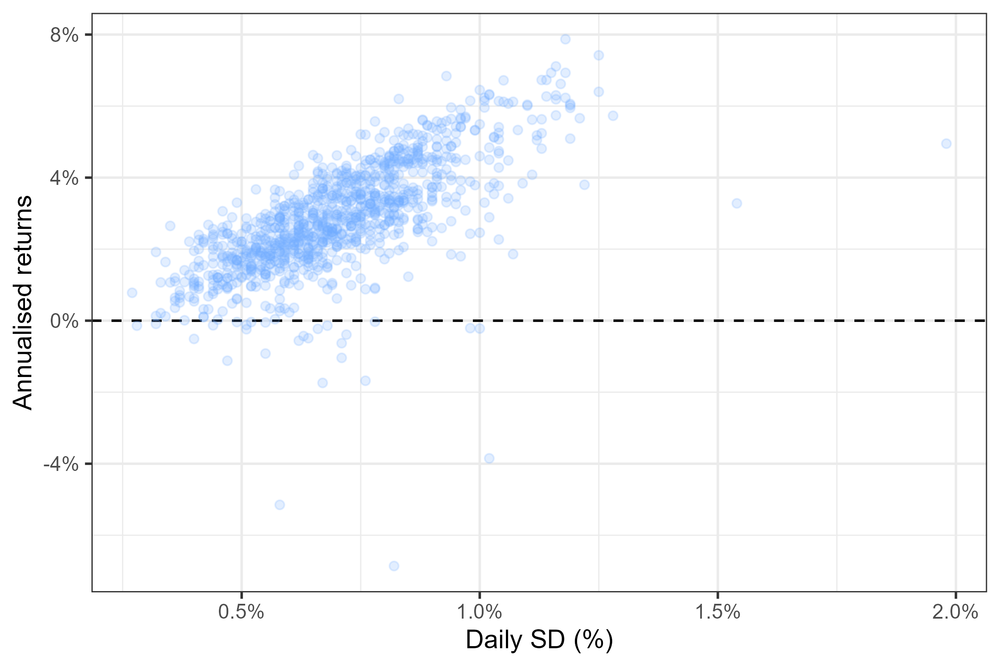

```{r setup, include=FALSE}
knitr::opts_chunk$set(echo = TRUE)

library(rmarkdown)
library(dygraphs)
library(ggplot2)
library(plotly)

colours_palette <- c("grey20", "#6ea8ffff", "red")
colours_background <- "#e6f0ff"
```


<style>
div.blue { background-color:#e6f0ff; border-radius: 5px; padding: 20px}
</style>

<div class = "blue">
<center><font size="+2"> **Disclaimer** </font></center>

The present article is intended for general educational purposes and is not meant to constitute financial advice to any person.  Readers are encouraged to seek financial advice from a qualified professional, and should not rely on this post to make investment decisions. The author does not give any warranty as to the accuracy of the information. This post was written for instructive purposes as an outside work activity. Any opinion or method presented here is my own and does not represent my current employer's (UBS) views or methods.

</div>
<br>


## A quick introduction to Modern Portfolio Theory 


Modern Portfolio Theory (MPT) was developed by Harry Markowitz in the 1950s and become a cornerstone of financial theory, providing a framework for investors to achieve their financial goals while managing risk. This theory was so influential that Markowitz later went on to win a Nobel prize. Let's quickly recap the key ideas of this theory, which you will see are quite simple. 

MPT starts with the fundamental concept that an investor should not focus solely on the potential return of individual investments, but also take into account their risk characteristics. Simply stated, in MPT the goals of the investors is to **maximize portfolio returns while minimizing risk**. Where risk is measured by the volatility of the returns (standard deviation of returns). 

MPT suggests that by combining investments with different risk and return characteristics in a portfolio, investors can achieve a more favorable risk-return tradeoff. **The key to achieving an efficient portfolio is diversification**. By spreading investments across different asset classes, such as stocks, bonds, and other securities, investors can reduce the overall risk of their portfolio. This is because different assets tend to have varying performance patterns over time. When some investments are declining, others may be rising, helping to offset losses and stabilize overall portfolio returns. **Ideally, we want assets in the portfolio to be as uncorrelated as possible**.

To construct an optimal portfolios using MPT, we normally use **historical data** to estimate the expected returns and risk (standard deviation), and correlations of different assets. This information is then **used to find out which combination of assets offers the highest expected return for a given level of risk**, or equivalently the lowest risk for a desired level of return. As illustrated in the figure below, we could plot the risk-return profile of all possible portfolios. Each dot corresponds to the risk-return profile for a different combination of assets. The portfolios that maximise returns while minimising risk are all the ones along the **efficient frontier** because for any level of risk (standard deviation), these are the portfolios that offer the highest return. 

```{r, echo = FALSE, fig.align="center", fig.cap="Efficient frontier", out.width = "50%"}

```


The efficient frontier offers a sort of menu for the investor. A hypothetical investor could fix it's level of desired risk (or return) based on its preference and use the efficient frontier to find out the portfolio combination that best satisfies it's risk appetite (return appetite). 

It's important to note that MPT has its limitations. It assumes that historical data is a reliable indicator of future performance, which often does not always hold true. Market fluctuations are not modelled in MPT and variance is used to model risk while better measures for downside risk exist. Additionally, it does not take into account any other aspect beside returns and volatility.  For instance, knowledge on long term trends and ethical or environmental concerns will not affect the asset selection. That being said, MPT still holds a very important place in finance.

In the next section I will provide a demonstration of how a set of securities can be combines into a more efficient investment allocation according to MPT.


## Practical demostration of portfolio optimization


### Data for the demonstration

I will use a list of funds from UBS to show how they could be combined to reach a more efficient portfolio. If you wish to follow along, you may download [the funds list](https://fbellelli.com/posts/portfolio_optimization/ubs_funds_with_TER.csv), and [the historical return data](https://fbellelli.com/posts/portfolio_optimization/net_returns_chf.csv) here.

```{r}

# load table with funds' information
funds <- read.csv("ubs_funds_with_TER.csv", stringsAsFactors = FALSE)

# load cleaned historical returns data
prices <- read.csv("net_returns_chf.csv", stringsAsFactors = FALSE)

```

The first table (`funds`) contains a list of all the UBS funds with some basic information, such as:

* __name__: the name of the fund
* __currency__: the currency of the fund
* __TER__: [Total Expense Ratio](https://en.wikipedia.org/wiki/Total_expense_ratio) of the fund. This is a measure of the average fees associated with each fund (expressed in percentage). 
* __ISIN__: the [ISIN code](https://en.wikipedia.org/wiki/International_Securities_Identification_Number) of the fund. This is a code that uniquely identifies financial products.
* __url__: url of the [swissfunddata.ch](https://iwww.swissfunddata.ch/) page from which the historical return data was downloaded and where more information on the fund can be found.

You can explore this list of funds in the table below.

```{r echo = FALSE}
paged_table(funds, options = list(cols.min.print = 3))
```


The second table (`prices`) contains the historical return data for each fund. The total return data was downloaded from [swissfunddata.ch](https://iwww.swissfunddata.ch/). [Total returns](https://www.investopedia.com/terms/t/totalreturn.asp) is the amount of money an investor would earn if it invested in the fund, it include both changes in price and dividend/coupon payments. I performed some additional cleaning to better compare the returns across different funds. In particular, I calculated the **net returns** by deducting the total expense ratio (TER) to each fund's returns (spreading the cost over all the year) and **converted all values to a common currency**: Swiss Francs (CHF). The data for the daily exchange rates was sourced from yahoo finance.  The figure below, shows what this data looks like for the first three funds in the list.

```{r echo = FALSE, fig.cap = "Total returns for the first three funds", fig.align='center'}

# format data
prices$Date <- as.Date(prices$Date)
temp <- prices[,1:4]
colnames(temp)[2:4] <- funds$name[match(colnames(temp)[2:4], funds$ISIN)]

# plot graph
dygraph(data = temp, xlab = "Year") %>% 
  dyRangeSelector() %>%
  dyOptions(colors = colours_palette,
            gridLineColor = colours_background)
```


### Finding an efficient portfolio

The key assumption when we are performing this optimization exercise is that we assume future performance of an asset to be like it's past performance, at least in the long run. So, for instance, if a stock has been delivering a 2% annual growth over the last ten years, we will assume this trend will continue in the future. 

Hence, our first step is to summarise past performance of our candidate funds. *There are three metrics which we need to derive: 1) the average returns, 2) the variance of the returns, and 3) the covariance matrix*. The average returns is a measure of the fund's long term trend, the variance measures how frequently/strongly the returns fluctuate around this trend, and the covariance matrix captures how different funds tend to move together (their correlation). We will assume these measures will stay fixed in the future. 

#### Calculating the mean, variance and covariance matrix

To calculate the mean, variance and covariance matrix, I start by transforming the fund prices into [log returns](https://quantivity.wordpress.com/2011/02/21/why-log-returns/). In many applications, log returns are more handy to work with because instead of compounding, they can just be added up. 


```{r}

# CALCULATE (DAILY) LOG RETURNS

# initiate an empty table with the dates only
returns <- data.frame("Date" = as.Date(prices$Date))

# Loop over every security and calculate the log returns
for (i in funds$ISIN){
  
  #Add the log returns to our new table
  returns[,i] <- log(prices[,i]) - c(NA, log(prices[1:(nrow(prices)-1),i]))
  
}

```


Now let's calculate the mean, variance and covariance matrix. This is straightforward in R. Note that we have different data points for each fund. So, some values are calculated over longer periods than others. In the case of the covariance matrix, we use all the data points available for each pair of funds. This may result in a covariance matrix that is not positive semidefinite (which could be an issue for some optimization techniques).


```{r}
# CALCULATE RETURNS' MEAN AND VARIANCE

# for each security calculate the mean, the variance and also store the number of data points (n)
for (i in funds$ISIN){
  
  funds[match(i, funds$ISIN), c("exp_return", "exp_volatility", "n")] <- c(
    "exp_return" = mean(returns[,i], na.rm = TRUE),
    "exp_volatility" = var(returns[,i], na.rm = TRUE),
    "n" = sum(!is.na(returns[,i]))
  )
  
}

# CALCULATE COVARIANCE MATRIX (with pairwise deletion)

covar <- cov(returns[, !(colnames(returns) %in% c("Date", "year"))], use = "pairwise.complete.obs")


```


The plot below summarises the mean/standard deviation for all the funds in our list. It shows the return and volatility we would expect if we were to invest entirely in one asset. However, when creating a portfolio we can combine multiple assets to create a "blend" of returns and risk profiles. In other words, we can position ourselves anywhere between these dots. Moreover, we can use diversification of the portfolio to reduce the risk while keeping the expected return constant. Let's see a technique to find an efficient portfolio now.


```{r, echo = FALSE, fig.cap= "Risk/return plot for the funds in the example list", fig.align='center'}

temp <- funds[,c("name", "exp_return", "exp_volatility", "n", "TER", "currency")]
temp$exp_return <- round(100*(exp(250*temp$exp_return)-1),2)
temp$exp_volatility <- round(100*sqrt(temp$exp_volatility),2)

p <- ggplot(temp, aes(y = exp_return, x = exp_volatility, text = name, label2 = n, label3 = currency, label4=TER))+
  geom_point(colour = colours_palette[2])+
  geom_hline(yintercept = 0)+
  theme_bw()+
  scale_y_continuous("Annualised returns (%)")+
  scale_x_continuous("Daily SD")
ggplotly(p)
```


#### Simulating random portfolios

We can form a portfolio by assigning a weight comprised between 0 and 1 to each asset, such that the sum of all weights add up to 1. Finding the optimal portfolio corresponds to solving a convex optimization problem, in which we are minimizing variance for any fixed level of return by tuning the weights of each assets (the parameters of the problem). An exact solution exists for such a problem, however in practice it is often hard to find the optimal weights if there are hundreds of assets in the portfolio. The optimisation problem is further complicated by the addition of limitations on the weights. For instance we might impose that **1)** weights need to be non-negative (i.e. we only allow long positions), and that **2)** we wish only a limited number of non-zero weights because of the potentially higher transaction costs involved in having many assets in the portfolio. Finally, the optimal solution might also be very sensitive to small changes in the inputs. Therefore, a common approach is to use a simulation to approximate the optimal portfolio. While such an approach might not yield THE EXACT optimal portfolio, it gets close enough and the calculations are simpler to implement.

The following graph shows the expected volatility and returns from 200'000 random portfolios in which we fix the maximum number of assets to 10 and only allow long positions (no negative asset weights). The edge of the cloud of simulated portfolio reminds us of the efficient frontier we introduced at the beginning of the post — this is no accident. Below you will find the code to replicate such an experiment.


```{r echo = FALSE, fig.cap = "Return/Volatility of 200'000 randomly generated portfolios", fig.align = "center", out.width = "90%"}
knitr::include_graphics("simulated_portfolios_random.png")
```


```{r echo = TRUE, eval = FALSE}
sim_random_portfolios <- function(x, # column vector of returns
         covar, # covariance matrix
         n = 10000, #number of simulations
         n_securities = 10){ #limit on the number of assets in the portfolio
  
  # transform returns into a column vector (for matrix multiplication)
  x <- matrix(x, ncol = 1)
  
  # initiate table to store portfolio stats
  tab <- data.frame(matrix(NA_real_, ncol = 2, nrow = n))
  colnames(tab) <- c("returns", "volatility")
  
  # initiate list to store portfolio weights
  weights <- list()
  
  # initiate percentage counter
  percentage <- 0
  
  # perform simulations
  for (i in 1:n){
    
    # random draw for weights
    w <- 0
    while (all(w==0)){
      w <- rep(0, nrow(x))
      securities_in_portfolio <- sample(1:nrow(x), size = n_securities, replace = FALSE)
      w[securities_in_portfolio] <- runif(n_securities, min = 0, max = 1)
    }
    
    # scale back weights to norm 1
    w <- w/sum(w)
    
    # save weights
    weights[[i]] <- w
    
    # calculate returns and volatility of portfolio
    portfolio_sd <- t(w) %*% covar %*% w 
    portfolio_returns <- t(w) %*% x

    # save results in summary table
    tab[i,] <- c(portfolio_returns, portfolio_sd)
    
    # Print percentage progress to console
    if (round(100*i/n) > percentage) percentage <- round(100*i/n)
    cat(paste0("\r Progress:", stringr::str_pad(percentage, width = 3, side = "left", pad = " "), "%"))
  }
  
  return(list(summary = tab, weights = weights))


} 
```


#### A more efficient simulation 

The brute-force approach we just presented is not very efficient: we are simulating a very large number of portfolios (200000), but most of them are not very good choices, many yield negative expected returns! We can try to concentrate our simulations on portfolios which we think can yield superior return/risk profiles, we will do this by:

1) Instead of picking asset allocations at random, we will give a higher chance to assets that were present in simulated portfolios with higher sharp ratio (the ratio of returns to volatility). This will slowly push the simulation towards better portfolios.

2) At each simulation we allow one asset to be introduced completely at random. This ensures we try new combinations of assets, some may be bad, but others might improve the mix.

3) Every now and then, we completely reset all the sampling probabilities to better explore the different coombinations of assets. This ensures we do not get stuck with a small number of assets and stop exploring other options.


The figure below shows 1000 simulated portfolios. This approach seems to have improved our simulation! Compared to the previous graph, we are spending more time in the upper diagonal, close to the "efficient frontier". 

```{r echo = FALSE, fig.cap = "Return/Volatility of 1000 simulated portfolios", fig.align = "center", out.width = "90%"}

```


```{r echo=TRUE, eval = FALSE}
sim_optim <- function(x, # vector of returns
                       covar, # covariance matrix
                       n = 10000, #number of simulations
                       n_securities = 6, # number of securities in portfolio
                       n_resets = 5){ # number of times to reset sampling probs
  
  # transform returns into a column vector (for matrix multiplication)
  x <- matrix(x, ncol = 1)
  
  # initiate table to store portfolio stats
  tab <- data.frame(matrix(NA_real_, ncol = 2, nrow = n))
  colnames(tab) <- c("returns", "volatility")
  
  # initiate list to store portfolio weights
  weights <- list()
  
  # initiate percentage counter
  percentage <- 0
  
  # initiate storage variables
  max_sharpe <- 0
  hist_sharpe <- NULL
  hist_security_selection <- rep(0, nrow(x))
  
  # perform simulations
  for (i in 1:n){
    
    # rest sampling probabilities 
    if (i %in% c(1, 1:(n_resets - 1) * floor(n/n_resets))){
      prob_sec <- rep(1/nrow(x), nrow(x))
    }
    
    # random draw of asset weights
    w <- 0
    while (all(w==0)){
      
      # use sampling prob to select securities in portfolio
      securities_in_portfolio <- sample(1:nrow(x), size = n_securities, prob = prob_sec, replace = FALSE)
      
      # replace one of the securities completely at random to explore new space
      securities_in_portfolio[1] <- sample(c(1:nrow(x))[!(1:nrow(x) %in% securities_in_portfolio)], size = 1)
        
      # random weights
      w <- rep(0, nrow(x))
      w[securities_in_portfolio] <- runif(n_securities, min = 0, max = 1)
      
      # keep track of number of times each security is used
      hist_security_selection[securities_in_portfolio] <- hist_security_selection[securities_in_portfolio] + 1 
    }
    
    # scale back weights to norm 1
    w <- w/sum(w)
    
    # save weights
    weights[[i]] <- w
    
    # calculate returns and volatility of portfolio
    portfolio_sd <- t(w) %*% covar %*% w 
    portfolio_returns <- t(w) %*% x

    # save results in summary table
    tab[i,] <- c(portfolio_returns, portfolio_sd)
    
    # store adjusted sharpe ratio of current portfolio
    sharpe <- portfolio_returns/portfolio_w_obs
    hist_sharpe[i] <- sharpe
    
    # update sampling probability vector if it is the best portfolio
    if (sharpe >= max_sharpe){
      
      # update prob vector
      prob_sec <- w * as.vector((1 + log((1 + sharpe)/(1 + max_sharpe))))
      prob_sec <- prob_sec / sum(prob_sec)
        
      # store current Sharpe ratio as new best 
      max_sharpe <- sharpe 
      
    }
    
    # paste simulation percentage to console
    if (round(100*i/n) > percentage) percentage <- round(100*i/n)
    cat(paste0("\r Progress:", stringr::str_pad(percentage, width = 3, side = "left", pad = " "), "%"))
  }
  
  return(list(summary = tab, weights = weights, hist_sharpe = hist_sharpe, freq_securities = hist_security_selection/n))
  
  
} 
```


### Conclusion: picking a portfolio

Now that we have simulated a very large number of combinations, all that is left to do is pick the portfolio that best satisfies our return/risk preference. In the figure below, I have plotted a cloud of 10000 simulated portfolios and highlighted in red the portfolios with the highest sharp ratio offering respectively at least: 1%, 2%, ... and 8% annual return. You may think of these as options from which a potential investor could pick from.


```{r echo = FALSE, fig.cap = "A selection of the most efficient portfolios", fig.align = "center", out.width = "90%"}
knitr::include_graphics("simulated_portfolios_with_selection.png")
```


Besides the simulated portfolios, our algorithm also provides a way of ranking securities. Since our algorithms tries to find better combinations of assets at each simulation, it is implicitly ranking the assets to find the best one. We can extract the final list of the best securities by looking at the assets that were chosen most often in the simulated portfolios. The list is reported below. A portfolio could be built from these securities.


```{r echo = FALSE}
temp <- read.csv("top10_securities.csv")
temp$annualised_return <- round(temp$annualised_return, 3)
temp$daily_volatility <- round(temp$daily_volatility, 5)
paged_table(temp, options = list(cols.min.print = 3))
```


In conclusion, portfolio optimization based on MPT remains a valuable tool for investors, helping them make informed decisions and achieve a balance between returns and risk in their investment strategies. However, it is important for investors to consider other factors and seek professional advice to make well-rounded investment decisions.

