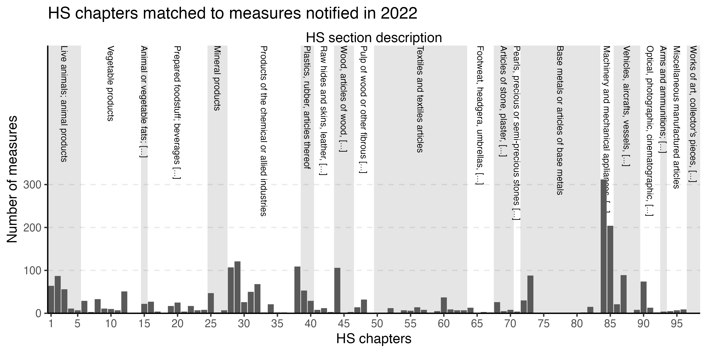

```{r setup, include=FALSE}
knitr::opts_chunk$set(echo = FALSE)
```


<style>
div.blue { background-color:#e6f0ff; border-radius: 5px; padding: 20px;}
</style>
<div class = "blue">

The data of the updated [EDB extension is available here](https://fbellelli.com/EDB-data.html).

</div>
<br>

Every year, the WTO updates its [environmental database (EDB)](https://edb.wto.org/) by adding the new environment-related policies that were notified to the secretariat. In their latest update, the WTO secretariat sorted and categorised *policies up to 2022*. I therefore recomputed and released the *EDB data extension*. This is a research dataset that tries to extract additional information from the text descriptions in the EDB, such as:

1) Identifying **implementation start and end years** of policies (the EDB only provides notification years)
2) Identifying the **[HS codes](https://en.wikipedia.org/wiki/Harmonized_System)** to which policies are related. HS codes are used to categorise goods flowing across borders.
3) Find similar/repeating policies within the database by calculating a **similarity** index-
4) Calculate an indicative **policy score** based on measure descriptions.

For downloading the data and more information on the EDB extension, refer to the data page:  [EDB extension v2022](https://fbellelli.com/EDB-data.html). The code for extracting the EDB extension is available at [code repo](https://github.com/fbellelli/EDB_extension_code).

As shown in the first figure at the end of the article, the new policies added to the EDB affect a variety of goods.  HS chapter 84 and 85 remain the most targeted by these policies. This is no surprise, as these HS chapters contain many parts and machineries related to green transition (e.g. wind turbines, batteries, heat pumps, filters for carbon capture, machinery for treatment of materials). Policies related to chemical goods are also popular (HS codes 28-38). The next two pictures show that developing countries appear to far fewer active policies (or perhaps notified less) than other and that the policy score components for last year remained roughly at the same level as in the past.


```{r, echo = FALSE, fig.align="center", out.width = "100%", layout="l-page"}

```

```{r, echo = FALSE, fig.align="center", out.width = "100%", layout="l-page"}
knitr::include_graphics("map_active_measures_last_year.jpg")
```


```{r, echo = FALSE, fig.align="center", out.width = "100%"}

```


